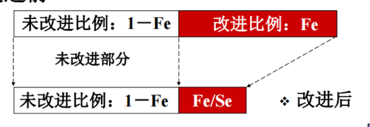
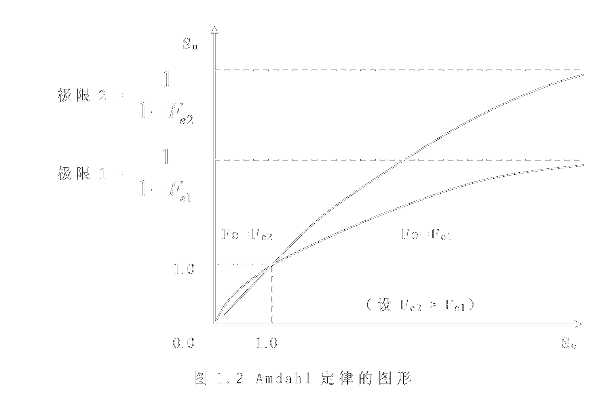
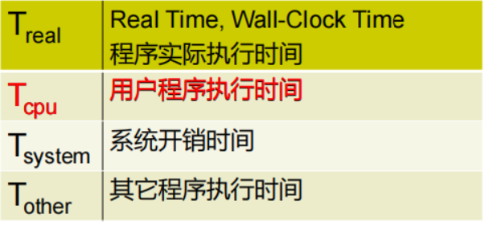
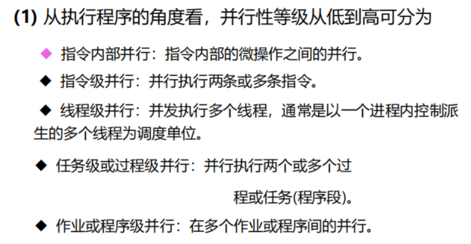
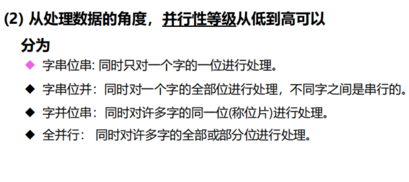
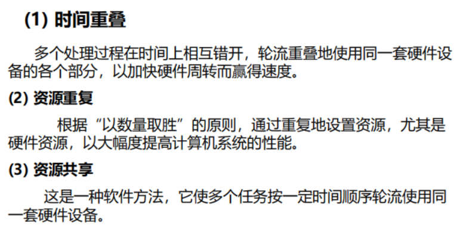

# 第一章 计算机系统结构的基础知识
## 1.1 计算机体系结构的概念
### 计算机系统中的层次概念
## 1.2 计算机系统设计
### 计算机系统设计中的量化方法
#### 大概率事件优先原则（哈夫曼压缩原理）
加快经常性事件的速度（make the common case fast）---优化的原
#### 阿姆达尔（Amdahl）定律
定义系统性能的加速比，确定对性能限制最大的部件，计算改进某些部件所获得的性能提高
#### CPU性能公式
执行一个程序所需要的CPU时间
#### 程序的局部性原理
程序的顺序执行和程序的循环等原因，程序往往重复使用它刚刚使用过的数据和指令
##### 时间局部性：
程序即将用到的信息很可能就是目前正在使用的信息（
近期被访问的程序，很可能不久又将再次被访问） 
##### 空间局部性
程序即将用到的信息很可能与目前正在使用的信息在空间上相邻或者临近（地址上相邻近的程序可能会被连续的访问）
## 1.3 计算机系统的性能评测
### 加速比
$$
    系统加速比(Sn) = \frac{系统性能_{after}}{系统性能_{before}} = \frac{总执行时间_{before}}{总执行时间_{after}}
$$
系统加速比依赖于两个因素：\
**可改进比例Fe**:  可改进部分在原系统计算时间中所占的
比例，它总是小于等于１的。\
*例子* 一个需运行60秒的程序中有20秒的运算可以加速，
那么该比例就是$\frac{1}{3}$ \
**部件加速比Se**： 改进后，可改进部分改进后性能提高比。
总的执行时间计算方法：
*(其中，afterimproved代表改进后的，beforeimproved代表改进前 ， unimproved代表未改进的（即不能改进的部分），improved代表可以改进的)*
$$
\begin{align*}
            T_{afterimproved} &= T_{unimproved} + T_{improved}\\
    &= (1 - Fe) * T_{beforeimproved} + \frac{Fe * T_ {beforeimproved}}{Se}  
\end{align*}
$$
系统加速比的计算方法：
$$ 
    Sn = \frac{T_{beforeimproved}}{T_{afterimproved}}
    = \frac{1}{(1 - Fe) + \frac{Fe}{Se}}
$$
当有多个部件可以加速的时候，其系统加速比的计算方法：
$$ 
    Sn = \frac{T_{beforeimproved}}{T_{afterimproved}}
    = \frac{1}{(1 - \sum_{i=1}^{n} Fe_i) + \sum_{i=1}^{n} (\frac{Fe}{Se})_{i}}
$$

加速比的计算方法

当$Fe \to 0$时候
$$
    \lim_{Fe \to 0}  \frac{1}{(1 - Fe) + \frac{Fe}{Se}}  = 1
$$
当$Se \to \infty$时候
$$
    \lim_{Se \to \infty}  \frac{1}{(1 - Fe) + \frac{Fe}{Se}}  = \frac{1}{(1 - Fe) }
$$
从图可以看出，增大Se和Fe对Sn都有提升作用；但
当Fe固定时，一味增大Se对Sn的作用会越来越不显著。

如果仅仅对计算机中的一部分做性能改进，则改进越多，系统获得的效果越小。 \
**推论**:  如果只针对整个任务的一部分进行优化，那么所获得的加速比不大于1/(1-fe)。 \
一个“好”的计算机系统：具有高性价比的计算机系统是一个带宽平衡的系统，而不是看它使用的某些部件的性能 。

### 时钟频率（处理机主频）
计算机系统中与实现技术和工艺有关的因素。单位是
MHz。\
时钟频率只能用于同一类型、同一配置的处理机,相对比较

**这是一种最简单的方式**
但是，这种方式也具备一定的局限性。

1. 没有考虑到CPI的不同
2. 没有考虑到其他子系统如内存、I/O的影响
3. 可重复，易测量，独立
4. 非线性，不可靠

### MIPS （每秒百万条指令 Millions Instructions Per Second）
公式：
$$
    MIPS = \frac{指令数}{T_{run} \times	 10^6} = \frac{主频}{CPI \times 10^6}
$$
特点：① 每条指令所执行的内容在不同体系结构中是不同的（如RISC精简指令集和CISC复杂指令集）
② 容易测量，可重复
③ 非线性，不可靠
### MFlops （每秒百万条浮点指令 Millions of FLoating-point Operations executed Per Second）
特点：\
◼ 不适合不执行浮点运算程序的系统 \
◼ 测量FLOPS并不容易，不同的浮点运算实现可\
能会带来不同的测试值\
◼ 可重复\
◼ 非线性，不可靠

与MIPS的缺陷：\
MIPS和Mflops都以单位时间内完成的操作次数为
性能度量 \
指令和浮点运算都不是人们最终关心的准确的操作

时间 是 计算机性能 的 **唯一可靠的** 测度!

## 1.4 用时间来描述一个计算机系统的性能
程序实际执行时间:
$$
    T_{real} = T_{cpu} + T_{system} + T_{other}
$$

### CPI
(Clock cycles per instruction), 每条指令所需要的时钟周期数 \
不同机器的指令执行时间不同，CPI也不同。因此对于一台机器来说，应该是其指令集所有指令执行的时钟周期数的平均值。

### CPU执行时间 $T_{cpu}$
公式：
$$
    T_{cpu} = \frac{CPU时钟周期数}{主频} = \frac{指令条数 × CPI}{CPU主频}
$$
取决于 ①CPI ②CPU主频 ③指令条数
## 1.5 计算机系统的性能评测
### 基准测试程序 Benchmarks
专门用于评估计算机性能的特定程序，能很好地反映机器在运行负载时的性能，可以通过运行在不同机器上进行测试的程序来评估计算机的性能。\
但，硬件设计人员，往往会针对基准测试程序而进行特殊的优化，以至于得不到很好的性能评测。
### 系列机
系列机是指一系列的计算机，每台计算机都有相同的体系结构和相同的基本指令系统，但型号不同
### 兼容
1. 向上(下)兼容：按某档机器编制的程序，不加修改的就能运行于比它高(低)档的机器。 
2. 向前(后)兼容：按某个时期投入市场的某种型号机器编制的程序，不加修改地就能运行于在它之前(后)投入市场的机器。
3. 向后兼容是软件兼容的根本特征，也是系列机的根本特征。
4. 软件兼容： 同一个软件可以不加修改地运行于体系结构相同的各档机器，而且它们所获得的结果一样，差别只在于有不同的运行时间。

## 1.6计算机体系结构中并行性的发展
### 并行性
在同一时刻或是同一时间间隔内完成两种或两种以上性质相同或不相同的工作。
只要时间上互相重叠，就存在并行性。

### 提高并行性

$$
    

$$