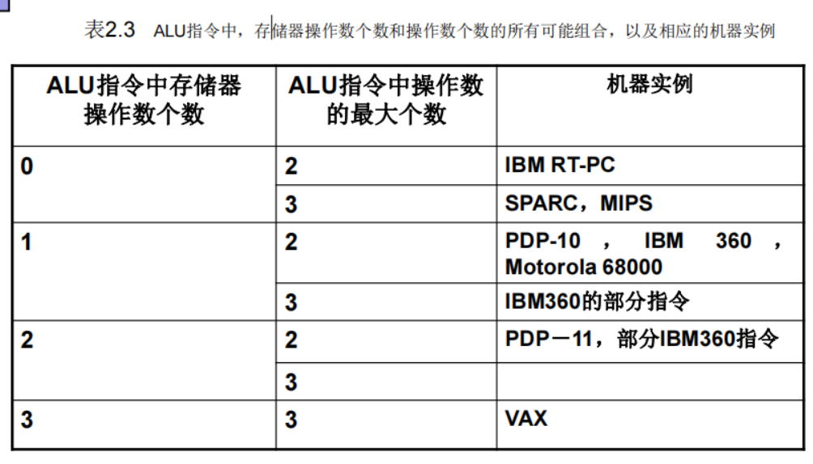
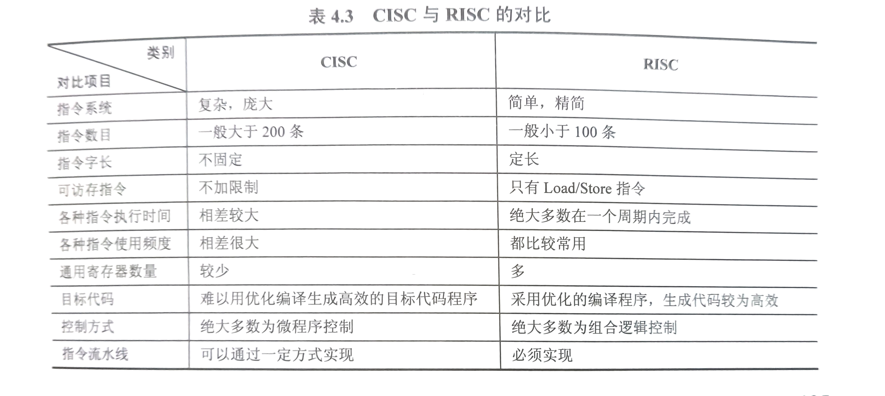
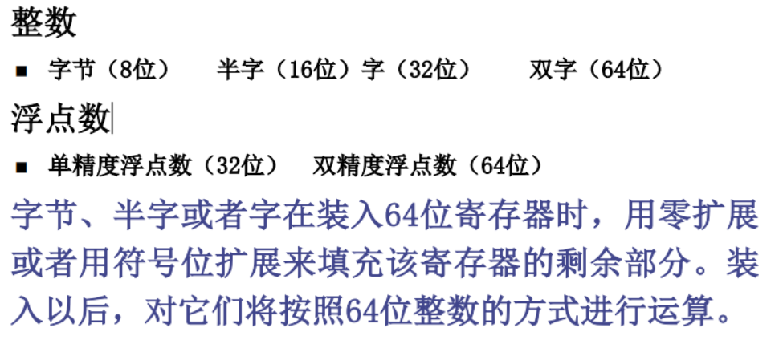
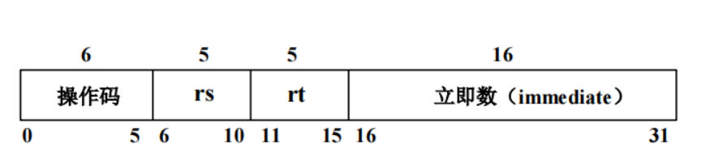
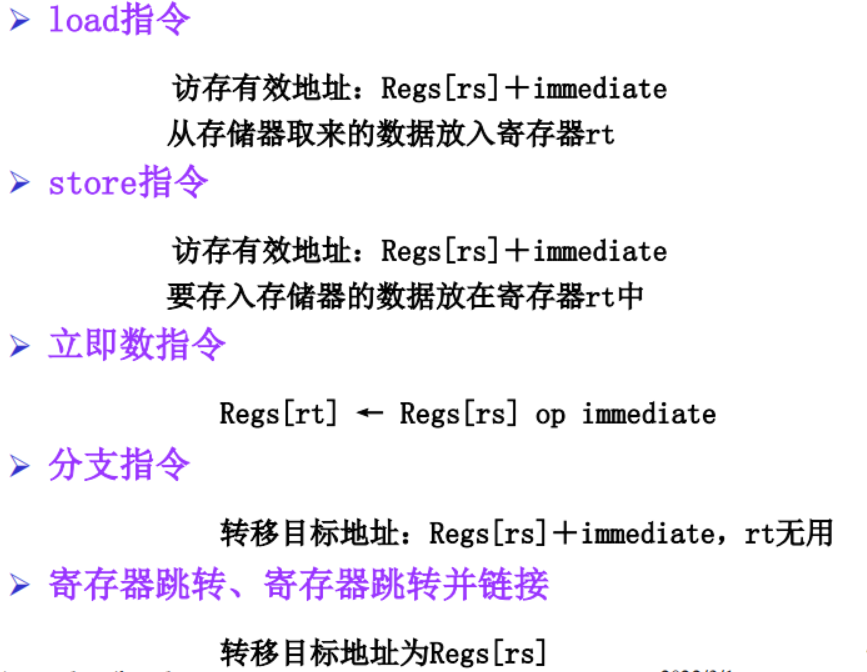
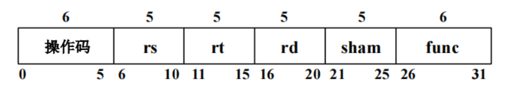
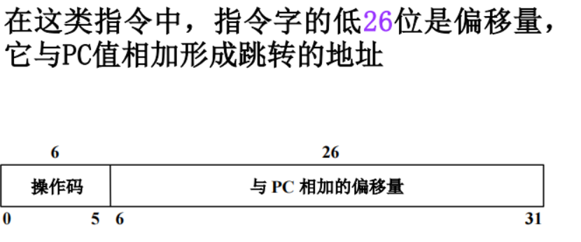
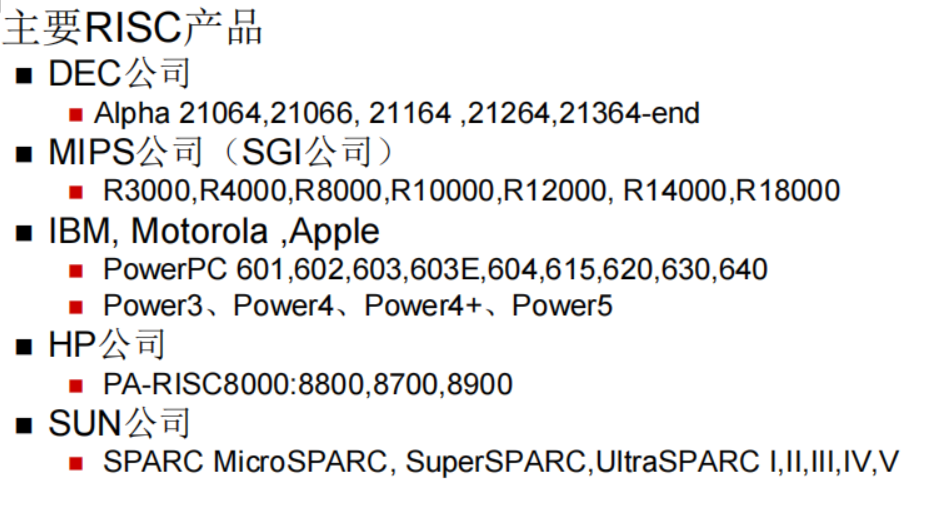

# 计算机指令集结构
## 指令集结构的分类
计算机中用来存储操作数的存储单元： *堆栈*，*累加器ACC*，*寄存器R*
### 寄存器－寄存器型（R-R）指令集（或 Load/Store型指令集结构）
其所有ALU指令都不包含存储器操作数
### 寄存器－存储器型（R-M）指令集
其ALU指令中包含有一个存储器操作数；
### 存储器－存储器型（M-M）指令集
其ALU指令中包含有一个以上存储器操作数
### 计算机指令集结构
1．指令格式和指令字长越单一，编译器工作越简单\
2.指令格式和指令字长具有多样性，能有效减少目标代码的大小，会增加编译器和CPU实现难度；\
3.CPU中寄存器的个数影响指令的字长。

## CISC、RISC指令比较
### CISC 
Complex Instruction Set Computer 复杂指令集计算机 \
代表： Intel、 AMD、VIA x86系列(IA-32、 X86-64)\
目标：强化指令功能，减少指令条数，以提高系统性能\
方法：面向目标程序的优化，面向高级语言和编译器的优化
#### 编译优化
◼ 高层优化：一般在源码上进行，同时把输出传递给以后的优化扫描步骤\
◼ 局部优化：仅在一系列代码片断之内（基本块）将代码优化\
◼ 全局优化：将局部优化扩展为跨越分支，并且引入一组针对优化循环的转换\
◼ 与机器相关的优化：充分利用特定的系统结构
### RISC 
Reduced Instruction Set Computing 缩减指令集计算机 \
代表： ARM、 MIPS、 SPARC、 PowerPC、 PA-RISC、 PA-RISC64\
目标：通过简化指令系统，用高效的方法实现最常用的指令\
方法：充分发挥流水线的效率，降低（优化）CPI
### VLIW
Very Long Instruction Word 超长指令集计算机 \
EPIC(Explicitly Parallel Instruction Computers 强制并行指令计算机)\
代表： IA-64（安腾Itanium）、crusoe
### 对比 （来自王道考研计算机组成原理）

## MIPS指令集结构
### MIPS的寄存器
**32个64位通用寄存器（GPRs，整数寄存器）**\
$R_0$永远为0\
**32个64位浮点数寄存器（FPRs）**\
用来存放32个单精度浮点数（32位），也可以用来存放32个双精度浮点数（64位）。
存储单精度浮点数（32位）时，只用到FPR的一半，其另一半没用\
**特殊寄存器** \
它们可以与通用寄存器交换数据。 例如，浮点状态寄存器用来保存有关浮点操作结果的信息。
### MIPS的数据表示

### MIPS的寻址方式
**立即数寻址与偏移量寻址**\
立即数字段和偏移量字段都是16位的。\
**寄存器间接寻址**是通过把0作为偏移量来实现的\
**16位绝对寻址**是通过把R0（其值永远为0）作为基址寄存器来完成的\

MIPS的存储器是按**字节寻址**的，地址为64位\
所有存储器访问都必须是**边界对齐**的
### MIPS的指令格式
32bit、寻址方式编码到操作码中，操作码占据6bit，有三类指令格式：

#### I类指令
包括 load、store、立即数指令、分支指令、寄存器跳转指令、寄存器链接跳转指令。

#### R类指令
ALU指令、专用寄存器读/写指令、move指令等。

**ALU指令**
$$
    Regs[rd] ← Regs[rs]  [funct]  Regs[rt] (funct为操作编码)
$$
#### J类指令
跳转指令、跳转并链接指令、自陷指令、异
常返回指令

### MIPS的操作
#### load和store
#### ALU操作
#### 分支与跳转
#### 浮点操作
由操作码指出操作数是单精度（SP）或双精度（DP）\
后缀S：表示操作数是单精度浮点数\
后缀D：表示是双精度浮点数

### RISC对优化编译器带来的困难
优化编译器必须选择变量存放位置，在哪个通用寄存 器中以便充分发挥通用寄存器效率。

优化编译器要进行数据相关和控制相关进行分析处理，和
硬件配合实现指令延迟转移或取消或重新排序。

对于RISC要设计复杂的子程序库，因为在CISC中一些复
杂指令在RISC中是由一级子程序来实现的。

编译优化要和机器的体系结构，编译程序技术结合进行。
如对于每个时钟周期能发送多条独立指令的超标量计算机编译程序必须正确分析，合理调度，才能更好的提高效率。

