# 流水线技术
指令流水线通过指令重叠减小 CPI。
## 指令流水线 ： 
把指令的解释过程分解为“分析”和“执行”两个子过程，并让这两个子过程分别用独立的
分析部件和执行部件来实现。 *理想情况下速度提高一倍*
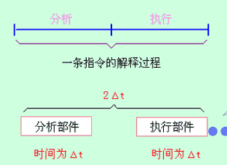

当分析部件完成上一条指令的分析后，立即进入下一条指令执行部件进行执行操作，同时，再分析下一条指令。 
## 浮点加法流水线
把浮点加法的全过程分解为“求阶差”、“对阶”、“尾数相加”、“规格化”四个子过程，并让它们分别用各自独立的部件来实现。*理想情况：速度提高3倍*

## 简单的5段流水线
五个阶段： 取指（IF）、译码（ID），执行（EX），存储器访存（MEM，Only Load and Store），写回（WB）。
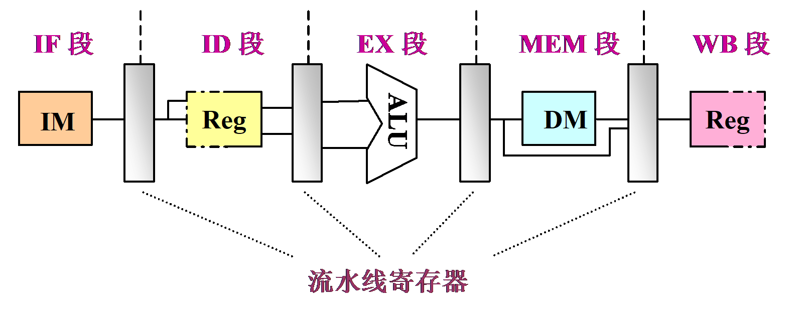
##  时－空图
时－空图从时间和空间两个方面描述了流水线的工作过程。时－空图中，横坐标代表时间，纵坐标代表流水线的各个段。
## 流水线分类
### 处理级别
操作级流水、指令集流水、处理器级流水（宏流水）
### 功能多少
单功能流水线：只能完成单一功能 \
多功能流水线：可以完成多种功能
### 按同一时间内各段之间的连接方式
**静态多功能流水线**：同一时间内只能输入一串运算操作相同的指令（即单一功能），其效率才能得到发挥。\
**动态多功能流水线**：同一时间可以允许多种功能的连接方式同时工作。优点：提高流水线效率；缺点：会使流水线控制变得复杂
## 流水线的性能指标
### 吞吐量
**单位时间**流水线所完成（输出）的任务数量
$$
    TP = \frac{n}{T_{all}}
$$
其中：
TP： 吞吐量 \
$n$:   任务数 \
$T_{all}$:  完成n个任务所需要的总时间

假设有k段流水线，每段流水线完成所需要的时间为Δt,在理想情况下，完成n个任务需要的总时间为$(k+n-1)Δt$,则在k段流水线下的理想吞吐率
$$
    TP = \frac{n}{(k+n-1)Δt}   
$$
并且存在 当 $n → ∞$是有
$$
    TP_{max} = \lim_{n → ∞} \frac{n}{(k+n-1)Δt}  = \frac{1}{Δt}
$$
### 加速比
完成同一批任务，使用流水线与不使用流水线的所用时间之比。
$$
    S = \frac{T_{不使用}}{T_{使用}} 
$$
假设有k段流水线，每段需要的时间为Δt,在理想的使用流水线的情况下，完成n个任务需要的总时间为$(k+n-1)Δt$, 在理想的不使用流水线的情况下，完成n个任务的总时间$knΔt$,则：
$$
    S = \frac{T_{不使用}}{T_{使用}}=\frac{knΔt}{(k+n-1)Δt} = \frac{kn}{k+n-1}
$$
并且存在 当 $n → ∞$是有
$$
    S_{max} = \lim_{n → ∞} \frac{kn}{k+n-1}  = k
$$

### 效率
流水线中的设备实际使用时间与整个运行时间
的比值，即流水线设备的利用率。由于流水线有通过时间和排空时间，所以在连续完成n个任务的时间内，各段并不是满负荷地工作。
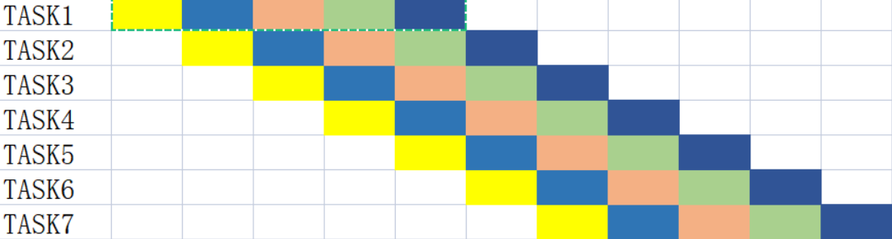

如图是，一个五段流水线执行七个任务，总的执行时间$(k+n-1)Δt = 11Δt$, 其中每一个阶段的效率都是相等的，且都为$eᵢ = \frac{7}{11}$, 所以总的效率
$$
    E = \frac{∑_{i=1}^{k} eᵢ}{k} = eᵢ = \frac{7}{11}
$$

设 k 段流水线，每段的流水线工作效率，为eₖ,
则 
$$
    E = \frac{∑_{i=1}^{k} eᵢ}{k} = eᵢ = \frac{n}{(k+n-1)Δt} = TPΔt = \frac{S}{k}
$$
当 n >> k (n → ∞) 时, 
$$
    E_{max} = \lim_{n → ∞} \frac{n}{k+n-1}  = 1
$$
## 流水线的最慢的段
事实上，流水线的每个段并不是都是相等的，在各段时间不完全相等的流水线中，时间最长的段叫做**瓶颈段**。
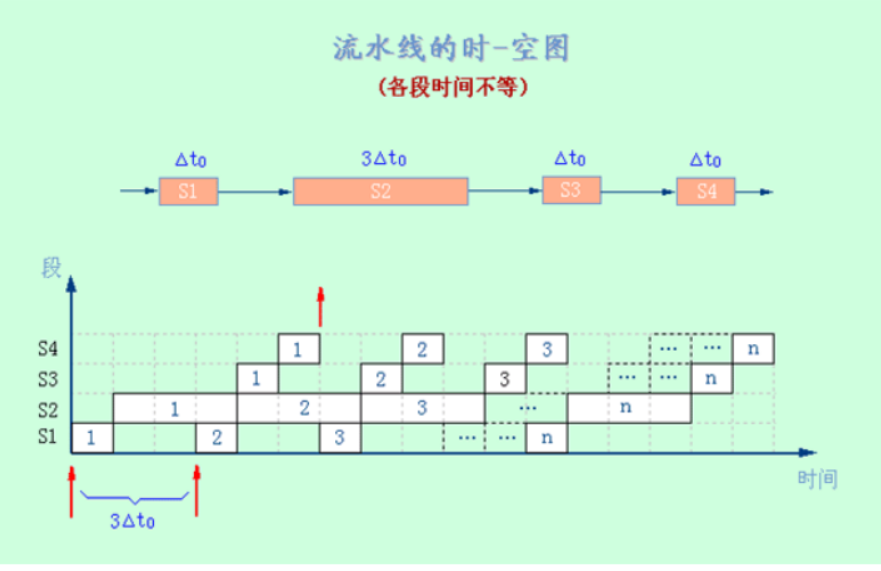

如图在这个 4段 流水线中，总共执行 n 个任务，可以显而易见的是部件二，占据了任务的一大部分\
当执行一个任务时候，$t₁= 6Δt₀$。\
当执行两个任务时候，$t₂= Δt₀ + 2×3Δt₀ + Δt₀ + Δt₀ = 6Δt₀ + 3Δt₀$。 \
.... \
当执行n个任务的时候$tₙ= Δt₀ + (n)×3Δt₀ + Δt₀ + Δt₀ = 6Δt₀ + (n-1)×3Δt₀$

故实际吞吐率：
$$
    TP = \frac{n}{ 6Δt₀ + (n-1)×3Δt₀}  
$$
当 n → ∞ 时
$$
    TP_{max} = \frac{1}{3Δt₀}  
$$

所以，当k段流水线，每一段流水线的时间为$Δt₀,Δt₁,Δt₂,...,Δt_{k-1}$的时候，执行n条指令，总耗时：
$$
tₙ= ∑_{i=0}^{k-1} Δtᵢ + (n-1)×\max(Δt₀,Δt₁,Δt₂,...,Δt_{k-1}) 
\tag{1}$$
$$
TP= \frac{n}{tₙ} =\frac{n}{∑_{i=0}^{k-1} Δtᵢ + (n-1)×\max(Δt₀,Δt₁,Δt₂,...,Δt_{k-1})}
\tag{2}$$
当 n → ∞ 时
$$
    TP_{max} = \frac{1}{max(Δt₀,Δt₁,Δt₂,...,Δt_{k-1})}
\tag{3}$$
此时，加速比变为
$$
    S = \frac{T_{unuse}}{T_{use}}
     = \frac{∑_{i=0}^{k-1} Δtᵢ}{
         ∑_{i=0}^{k-1} Δtᵢ + (n-1)×\max(Δt₀,Δt₁,Δt₂,...,Δt_{k-1}) 
     }
\tag{4}$$
并且存在 当 $n → ∞$是有
$$
    S_{max} = \frac{∑_{i=0}^{k-1} Δtᵢ }{max(Δt₀,Δt₁,Δt₂,...,Δt_{k-1})}
\tag{5}$$
此时，效率变为
$$
    E  = \frac{n× ∑_{i=0}^{k-1} Δtᵢ}{
         k×[ ∑_{i=0}^{k-1} Δtᵢ + (n-1)×\max(Δt₀,Δt₁,Δt₂,...,Δt_{k-1}) ]}
\tag{6}$$
从时空图上来看，效率可以看做：
$$
    E  = \frac{n个任务实际占用的时空区}{k个段的个段总的时空区}
\tag{7}$$
### 解决流水线的瓶颈
**细分瓶颈段**
将瓶颈段分割成更小的段的串联，如图:
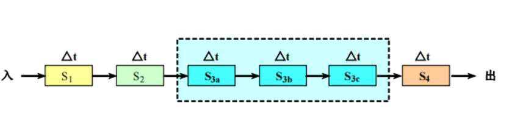
**重复设置瓶颈段**
将瓶颈段重复的设置，让不同的指令可以同时执行，而不冲突，如图：
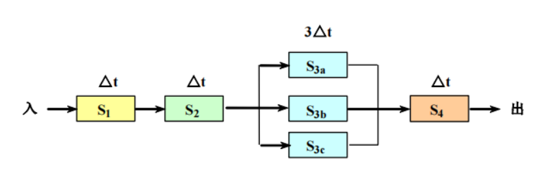

## DLX的基本流水线
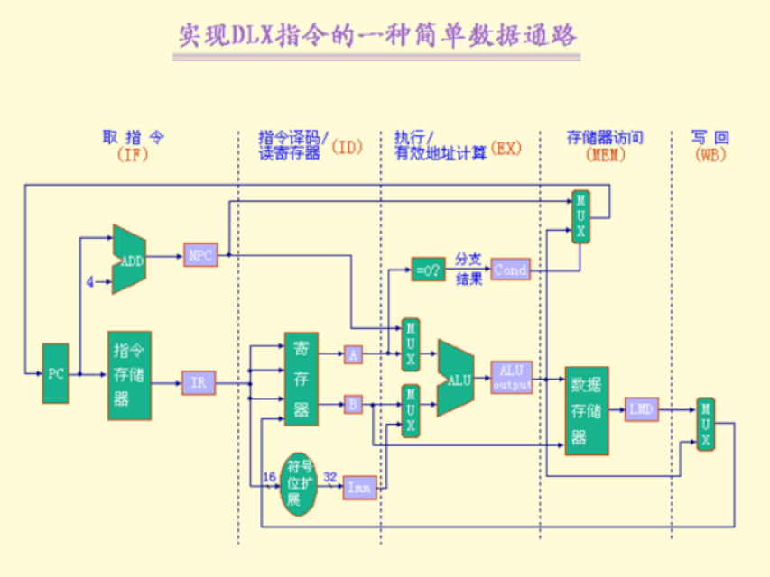

### 取指令周期（IF）
把指令送入指令寄存器IR，再把PC指向下一条指令（PC + 4）
### 指令译码/读寄存器周期（ID）
把寄存器（IR[IR₆..₁₀], 指令的6-10位是寄存器Rₛ的编号）中的值送入A，把寄存器（IR[IR₁₁..₁₅], 指令的11-15位是寄存器Rₜ的编号）中的值送入B, 对于立即数Imm，机器会将16位的立即数符号拓展为32位。
### 执行/有效地址计算周期（EX）
不同的指令有不同的操作。

**存储器访问**： ALUₒᵤₜ ← A + Imm 

**寄存器―寄存器 ALU 操作**： ALUₒᵤₜ ← A op B

**寄存器―立即值 ALU 操作**： ALUₒᵤₜ ← A op Imm

**分支操作**： 
ALUₒᵤₜ ← PC + Imm  或 Cond ← (A op 0)
### 存储器访问/分支完成周期（MEM）
在该周期处理的DLX指令只有$\color{#FF3030}{Load}$、$\color{#FF3030}{Store}$和$\color{#FF3030}{分支指令}$。

**存储器访问**: 
Mem [ALUₒᵤₜ] ← B 或者 LMD ← Mem[ALUₒᵤₜ]

**分支操作**:  如果条件成立，则将ALUₒᵤₜ送到PC
### 写回周期（WB）
不同指令在该周期完成的工作也不一样
**寄存器―寄存器型 ALU 指令**： 将ALUₒᵤₜ送到指令的第16-20位所指的寄存器中。

**寄存器―立即值型 ALU 指令**： 将ALUₒᵤₜ送到指令的第11-15位所指的寄存器中。

**Load 指令**： 将LMD送到指令的第11-15位所指的寄存器中。
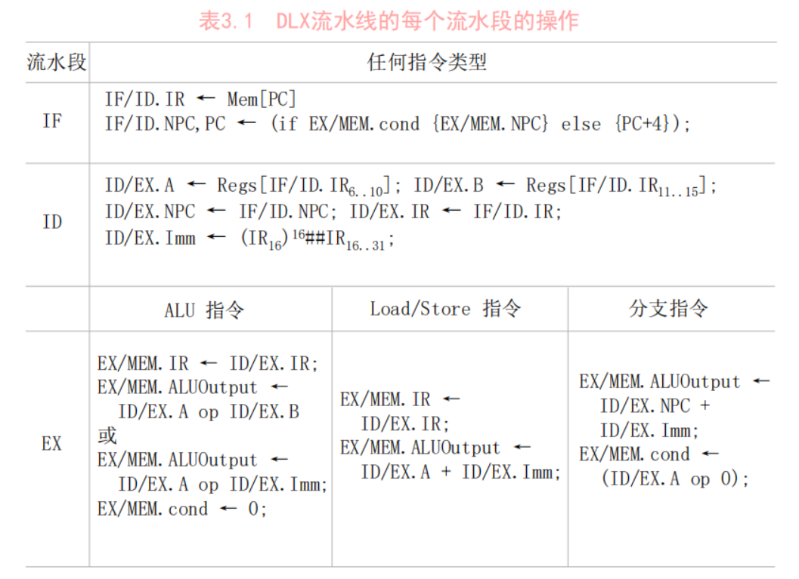
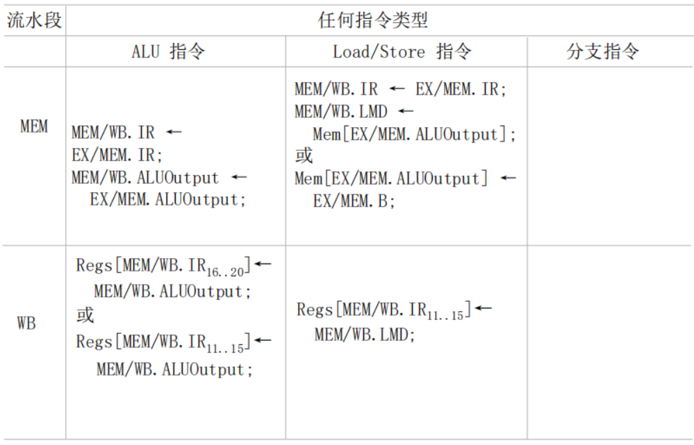

# 流水线的相关
流水线中的相关是指相邻或相近的两条指令因存在某种关联，后一条指令不能在原指定的时钟周期开始执行。
## 结构相关 (结构冒险)
多条指令在同一时刻同时争用一个资源而形成的冲突。
### 消除办法
暂停等待、资源重复
## 控制相关 (控制冒险)
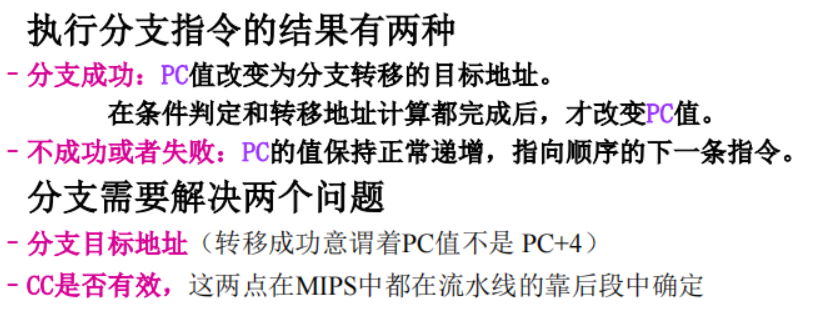
指令通常是顺序执行的，在遇到一些改变指令执行顺序的情况，如转移、返回、调用，会改变PC值，会造成断流的情况。
### 消除办法
分支预测，尽早生成转移地址

预取转移成功和不成功的两个控制流方向上的目标地址

加快和形成条件码

提高转移方向上的猜准率

"冻结"或者"排空"流水线 。(简单)
## 数据相关 (数据冒险)
下一条指令会用到当前指令输出的结果，会造成数据冲突。
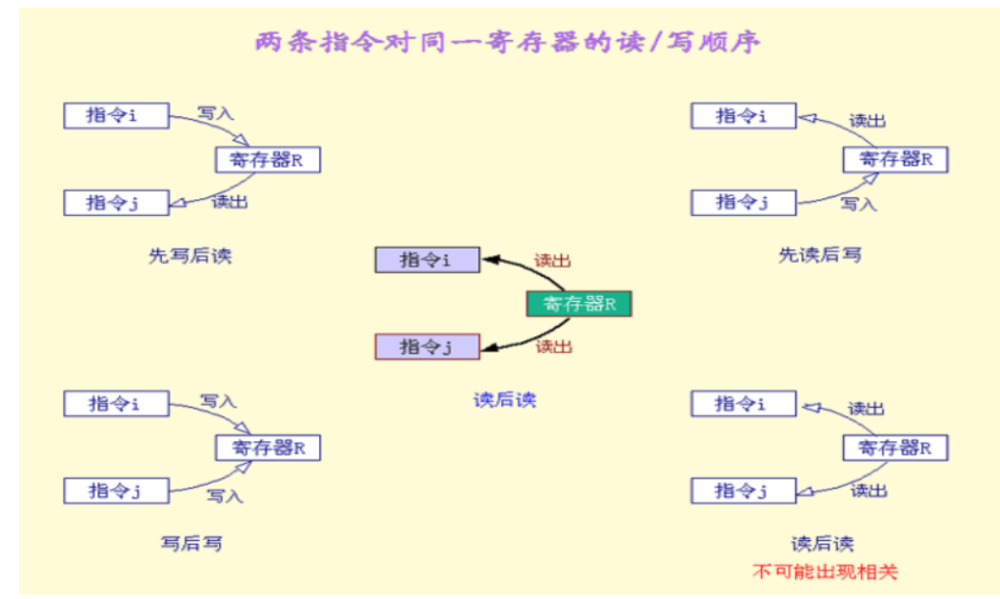
### 写后读数据相关 （RAW）
当前指令在写回后，下一条才能读
### 读后写数据相关   (WAR)
当前指令在读出完毕后，下一条才能写回
### 写后写数据相关  (WAW)
当前指令在写回后，下一条才能继续写回
### 消除办法
**数据旁路技术（定向技术）**：设置专门的数据通路，在不等待把数据送回寄存器组的时候，直接读取ALU的计算结果作为自己的输入
**编译优化**：调整指令执行顺序

**暂停**：暂停一个或多个周期，直到冲突消失。包括硬件阻塞Stall和软件阻塞NOP（空指令）
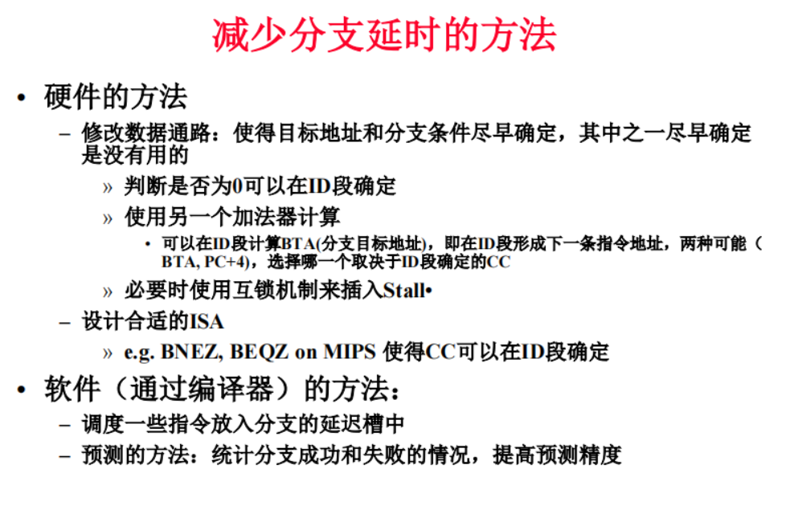

# 高级流水线技术
## 超标量流水线
动态多发射技术，每个时钟周期内可以并发多条独立的指令，以并行的方式编译和执行，需配置多个功能部件。**不能调整指令的执行顺序** ，通过编译优化技术可以挖掘其更多的并行性。
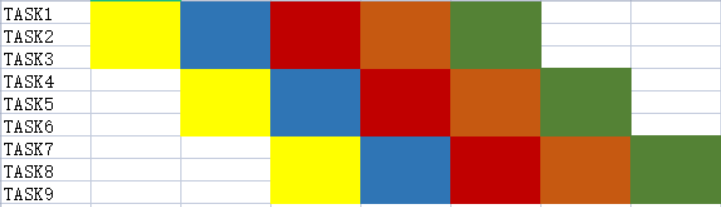
## 超长指令字长
静态多发射技术，由编译程序完成，将多条可以并发执行的程序拼接成一条具有多个操作码的超长指令字执行，需配置多个功能部件。
## 超流水线技术
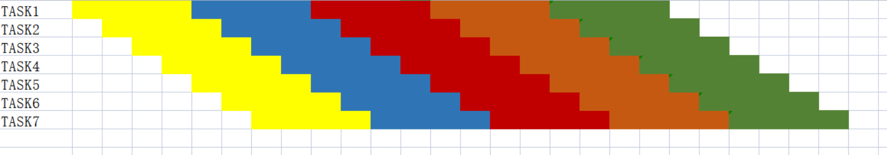
流水线级数越多，时钟周期就越短，吞吐率就越高。
通过提高流水线主频来提高流水线性能。但是流水线级数越多，用于流水寄存器的开销越大，故不是越多越好。
超流水线CPU在充满后，每个时钟周期还是执行一条指令CPI = 1，但其主频更高。
多发射技术，CPI < 1，每个时钟周期可以处理多条指令。

