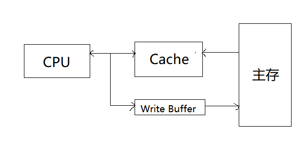
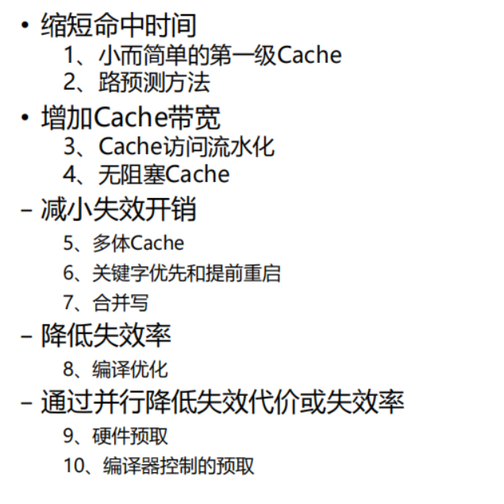

# 存储系统
速度越快，每位价格就高；
容量越大，每位价格就低；
容量越大，速度就越慢；
目前主存一般由DRAM构成；
目前Cache一般由SRAM构成；
## 局部性原理
**时间局部性**： 最近被访问的将来很可能还要访问

**空间局部性**： 最近被访问的信息临近的信息很可能被访问

## Cache
Cache利用的就是局部性原理

要求有足够高的命中率，既当 CPU需用主存中
的数据时，多数情况可以直接从Cache中得到，称
二者之比为命中率

现代计算机的Cache可能具备多级的结构，越靠近CPU的那一级，其速度越快，容量越小。
|  | Cache - 主存层次 | 辅存 - 主存层次 |
| ---------- | ---------- | -------------- |
| 目的 | 弥补主存容量不足 |  弥补主存容量不足 |
| 存储管理实现 | 硬件实现 |  软件实现 |
| 访问速度的比值 | 相差不太大 |  主存速度远大于辅存 |
| 典型的块(页)大小 | 几十个字节 |  几百到几千个字节 |
| CPU对第二级的访问方式 | 可直接访问 |  均通过第一级 |
| 失效时CPU是否切换 | 不切换 |  切换到其他进程 |

研究cache，要知道**映射规则**、**查找方法**、**替换算法**、**写入策略**。

一个Cache包含了以下的结构
| 有效位 | 标志字段 | 数据字段 |
|--|--|--|

### 写策略
写策略，就是确定何时更新主存。

**全写法** 
写入Cache的同时也写入主存（下一级存储器）\
优点：简单可靠\
缺点：总线操作频繁、影响工作速度\
解决方法：在Cache与主存间设置一个**写缓冲器**（Write Buffer），Write Buffer是一个FIFO的队列，由写缓冲控制将数据写入主存。但是频繁写入会使WriteBuffer写饱和。如图：

**回写法** 
只写入Cache，在被替换时才写回主存\
优点：可以减少写入主存次数、提高速度 \
缺点：硬件结构比较复杂 \
实现方法：为了表明Cache是否被修改，需要设置一个更新位（update，赃位dirty bit）。替换时只需将被修改的Cache块内容写入主存

对Cache的写不命中有以下两种方法：

**写分配法**
先把数据所在的块调入Cache，然后再进行写入。类
似读失效的方式，也称fetch on write

**非写分配法**
直接把数据写入下一级存储器，不将相应的块调入
Cache，也称write around

## Cache 性能评估
### 命中率H （失效率F）
与硬件无关！
$$
    T_{平均访存} = T_{命中} + F × 失效开销
$$
**分离Cache和混合Cache**：\
统一Cache的失效率:
$$
    F_{sum} = a
\tag{1}
$$
分离Cache的总体失效率:
$$
    F_{sum} = Rate_{取指占比}×Rate_{指令失效率} +  Rate_{数据比例}×Rate_{数据失效率}
\tag{2}
$$

## 映射方法
**直接映射**：\
Cache行号 = 主存块号    mod  Cache总行数\
**全相联映射**：\
主存中的每一块可以装到cache中的任何一块
**组相连映射**：\
将cache分为Q个大小相等的块，每个主存块可以放在固定组中的任意一行。*组间直接映射，组内全相联*

## Cache优化方法
# 降低失效率
增加Cache块的大小、增大Cache容量、提高相联度
### 增大Cache容量
对冲突和容量失效的减少有利
### 增大块
减缓强制性失效

可能会增加冲突失效（因为在容量不变的情况下，块
的数目减少了）
### 通过预取可帮助减少强制性失效

必须小心不要把你需要的东西换出去

需要预测比较准确（对数据较困难，对指令相对容易）

# 降低失效开销
多级cache、使读失效优先于写失效

• 局部失效率：$Rate = \frac{该级Cache的失效次数}{到达该级Cache的访存次数}$ \
• 全局失效率：该级Cache的失效次数/ CPU发出的访存总次数 \
    − 全局失效率是度量L2 cache性能的更好方法

# 缩短命中时间
避免在索引缓存期间进行地址转换: 在Cache中使用虚拟地址，避免Cache索引过程中地址变换
# 其他方法

