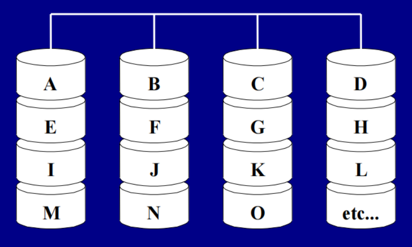
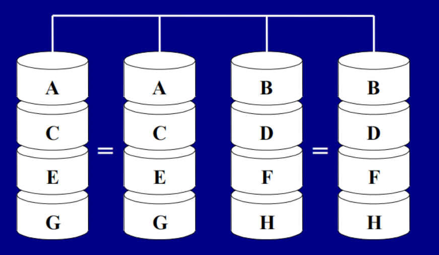
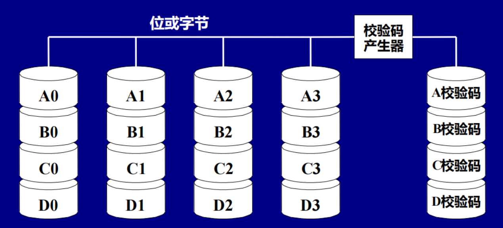
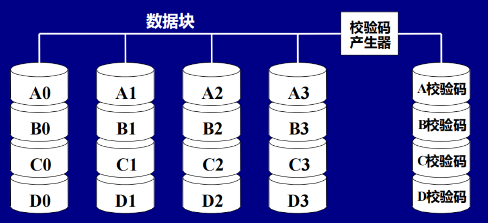
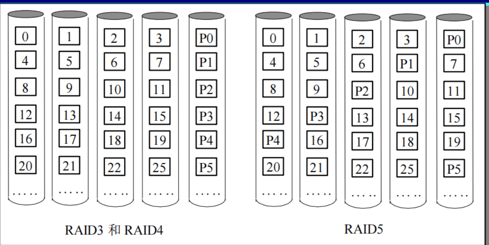
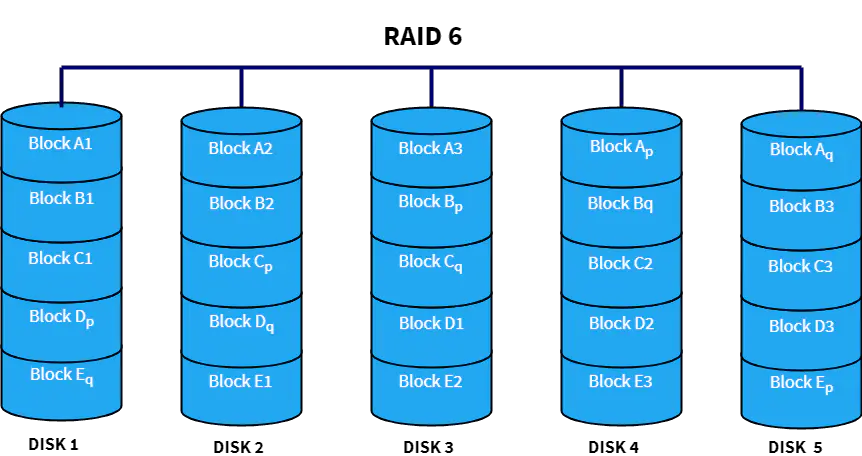

# 输入输出系统
包括I/O设备 和 I/O设备与处理机之间的连接。\
完 成 与 外 部 系 统 的 信 息 交 换\
结构计算机的重要组成部分之一。
## 衡量指标
### 响应时间（Response Time） 
### 可靠性（Reliability）

# 廉价磁盘冗余阵列RAID
容量大、速度快、可靠性高、造价低廉

数据复制技术：基于存储子系统数据复制、
基于存储网络层数据复制、
基于卷管理器数据复制、
基于应用数据复制。

## 各级RAID （数据磁盘数为 n = 8）
|level|name|数据磁盘故障和校验空间开销|优点|缺点||
|-|-|-|-|-|-|
|RAID0|带状非冗余磁盘阵列|0个故障、0个校验磁盘|无空间开销|无保护|广泛使用|
|RAID1|镜像磁盘阵列|n个校验磁盘、1个故障|无奇偶效验计算、快恢复、小数据的写速度高于其它RAID级、快速读。|最高的效验存储开销|EMC,HP,IBM|
|RAID2|存储器式ECC（采用纠错的海明码校验）|1个故障、4个校验磁盘|不依赖故障磁盘，自我诊断|以2为底的对数校验存储开销|未使用|
|RAID3|位交叉奇偶校验|1个故障、1个校验磁盘|较低效验开销；对大块的读写有高带宽|不支持小数据量或随机读写|存储概念|
|RAID4|块交叉奇偶校验|1个故障、1个校验磁盘|小数据量的读有高带宽|奇偶校验磁盘是小数据量的写瓶颈|网络设备|
|RAID5|块交叉分布奇偶校验|1个故障、1个校验磁盘|较低效验开销； 小数据量的读写有高带宽|小数据量的写-4个磁盘访问|广泛使用|
|RAID6|P+Q冗余|2个故障、2个校验磁盘|针对2个磁盘故障的保护|小数据量的写-6个磁盘访问；2X校验开销|网络设备|

### 共性
◆ RAID由一组物理磁盘驱动器组成，操作系统
视之为一个逻辑驱动器；\
◆ 数据分布在一组物理磁盘上；\
◆ 冗余信息被存储在冗余磁盘空间中，保证磁
盘在万一损坏时可以恢复数据；\
◆ 其中第2、3个特性在不同的RAID级别中的表
现不同，RAID0不支持第3个特性。

### RAID0 带状非冗余磁盘阵列
数据分块，即把数据分布在多个盘上。非冗余阵列、无冗余信息。

### RAID1 镜像磁盘阵列
每个对应一个镜像盘（备份盘、冗余盘），每一次复制的时候，会在冗余盘里产生一个备份

读性能好
RAID1的性能能够达到RAID0性能的两倍。 ◆

写性能由写性能最差的磁盘决定。相对以后
各级RAID来说，RAID1的写速度较快。

### RAID2 存储器式ECC（采用纠错的海明码校验的磁盘阵列）
 ◆并行存取，各个驱动器同步工作。\
  ◆ 使用海明编码来进行错误检测和纠正，数据
传输率高。\
 ◆ 需要多个磁盘来存放海明校验码信息，冗余磁盘数量与数据磁盘数量的对数成正比。 \
◆ 是一种在多磁盘易出错环境中的有效选择。\
并未被广泛应用，目前还没有商业化产品。

### RAID3 位交叉奇偶校验磁盘阵列
 单盘容错并行传输：数据以**位或字节**交叉存储，奇偶校验信息存储在一台专用盘上。

先将分布在各个数据盘上的一组数据加起来，将和存放在冗余盘上。一旦某一个盘出错，只要将冗余盘上的和减去所有正确盘上的数据，得到的差就是出错的盘上的数据。
### RAID4 专用奇偶校验独立存取盘阵列
数据以**块**(大小可变)交叉的方式存于各盘，奇偶校验信息存在一台专用盘上。

### RAID5 块交叉分布式奇偶校验盘阵列
数据以块交叉的方式存于各盘，无专用冗余盘，奇偶校验信息均匀分布在所有磁盘上。

### RAID6 P+Q冗余盘阵列
◆ 写入数据要访问1个数据盘和2个冗余盘；\
◆ 可容忍双盘出错\
◆ 存储开销是RAID5的两倍，RAID6的写过
程需要6次磁盘操作。

