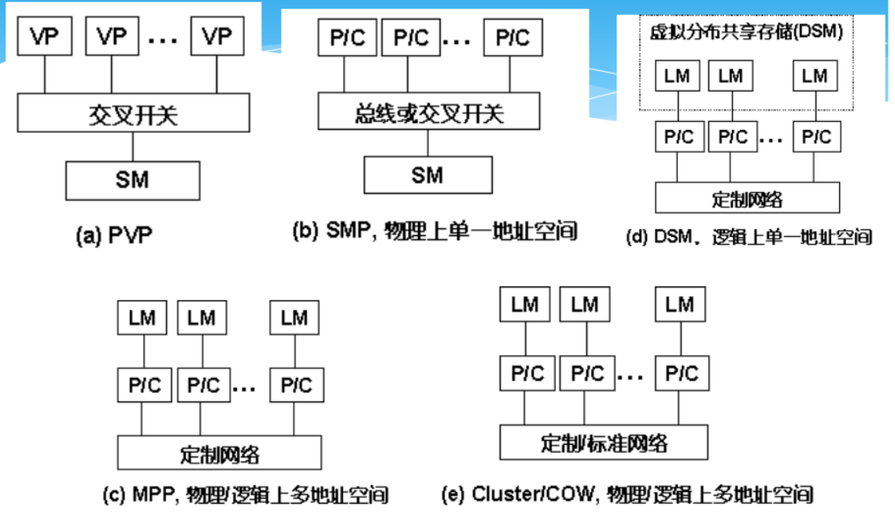

# 多处理机技术
## 概述
按照Flynn分类法，可把计算机分成:\
➢ 单指令流单数据流（SISD）\
➢ 单指令流多数据流（SIMD）\
➢ 多指令流单数据流（MISD）\
➢ 多指令流多数据流（MIMD）

多处理机 (共享存储)

多计算机 (分布式存储)

并行模型：MIMD为主流
 MIMD 具有灵活性\
 MIMD可以充分利用商品化微处理器在性能价格比方面的优势。\
 CMP：多核多线程\
 Cluster：集群

## 结构模型
PVP, SMP, MPP, DSM, COW

### SMP 对称式共享存储
任意处理器可直接访问任意内存地址,且访问延迟、带宽、几率都是等价的; 系统是对称的；

（IBM R50, SGI Power Challenge, SUN Enterprise, 曙光一号）

缺点： 处理机不能太多；总线和交叉开关难以拓展
### MPP 大规模并行计算机系统
物理和逻辑上均是分布内存；
能扩展至成百上千个处理器(微
处理器或向量处理器) ； 采用高通信带宽和低延迟的互联网络 (专门设计和定制的) ； 一种异步的MIMD机器；程序系
由多个进程组成，每个都有其私有地址空间，进程间采用传递消息相互作用；
### DSM 分布共享存储多处理机系统
分布共享存储: 内存模块物理上局部于
各个处理器内部,但逻辑上(用户)是共享
存储的; 这种结构也称为基于Cache目录
的非一致内存访问(CC-NUMA)结构;局部
与远程内存访问的延迟和带宽不一致,3-
10倍→高性能并行程序设计注意;

与SMP的主要区别：DSM在物理上有分
布在各个节点的局部内存从而形成一个
共享的存储器；

微处理器: 16-128个,几百到千亿次;

### 机群系统(Cluster)
 每个节点都是一个完整的计算机\
 各个节点通过高性能网络相互连
接\
 网络接口和I/O总线松耦合连接\
 每个节点有完整的操作系统

## 结构模型 ---- 访存模型

### 均匀存储器存取（UMA－Uniform 
Memory Access）

#### 对称多处理机系统(symmetric multi-processor)
所有处理机都能同样访问所有外围设备；所有处理机都能同样运行执行程序，如操作系统的内核、I/O服务程序
#### 不对称处理机系统(asymmtric multi-processor)
只有一台或一组处理机（MP主处理机）执行操作系统并操纵I/O，其余处理机（AP附属处理机）没有I/O能 力

### 非均匀存储访问(NUMA)
被共享的存储器在物理上是分
布在所有的处理其中的，其所
有本地存储器的集合就组成了
全局地址空间

### 非远程存储访问(NORMA)
所有存储器都是私有的，仅能由其处理器所访问; 绝大都数都不支持远程存储器的访问

## 传统指令级并行技术的问题

## 并行计算机
一组处理单元的集合，这些单元相互协作来快
速地求解大题目。 --- 协同、大任务

# 多处理机的一致性
## 原因
**I／O操作**
Cache中的内容可能与由I／O子系统输入输出形成的存储器对应部分的内容不同。

**共享数据** 不同处理器的Cache都保存有对应存储器单元的内容
## 实现一致性的基本方案
 **共享数据的迁移**
降低了对远程共享数据的访问延迟。\
**共享数据的复制**
不仅降低了访存的延迟，也减少了访问共享数据所产生的冲突。

## 基于监听的两种协议
### 写作废协议
在一个处理器写某个数据项之前保证它对该数据项有唯一的访问权
### 写更新协议
当一个处理器写某数据项时，通过广播使其它Cache中所有对应的该数据项拷贝进行更新。
### 性能上的差别
 对同一数据的多个写而中间无读操作的情况,写更新协议需进行多次写广播操作，而**在写作废协议下只需一次作废操作**\
 对同一块中多个字进行写，写更新协议对每个字的写均要进行一次广播，而**在写作废协议下仅在对本块第一次写时进行作废操作**\
 一个处理器写到另一个处理器读 之间的延迟通常在写更新模式中较低。而**在写作废协议中，需要读一个新的拷贝**\
在基于总线的多处理机中，**写作废协议成为绝大多数系统设计的选择**
# GPU
Graphics Processing Units 图形处理单元： 早期的GPU是指带有高性能浮点运算部件、可高效生成3D图形的具有固定功能的专用设备

是一个多线程协处理器

## 架构
CPU+GPU异构多核系统；CPU是强控制弱计算，GPU是弱控制强计算。

# 多核处理器

