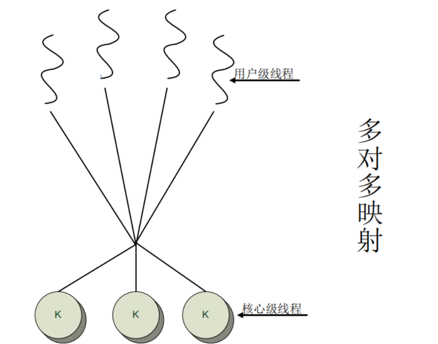

# 并行程序设计
## 进程
进程（process）可表示成四元组（P, C, D, S）\
◼ P是程序代码\
◼ C是进程的控制状态\
◼ D是进程的数据\
◼ S是进程的执行状态
### 进程的状态
◼ 非存在状态：进程依赖的程序还没有投入运行\
◼ 就绪状态：进程由其父进程调入并准备运行\
◼ 运行状态：进程占有CPU和其它必须的计算资
源，并执行指令\
◼ 挂起状态：由于CPU或其它必须的计算资源被
其它进程占有，或必须等待某类事件的发生，
进程转入挂起状态\
◼ 退出状态：进程正常结束或因异常退出而被废
弃
### 进程间通信
进程是操作系统资源调度的基本单位

多个进程之间相互交流信息 的三种形式 ：\
❑ 通信：进程间的数据传递称为进程间通信\
❑ 同步：同步是使位于相同或不同处理机中的多个进程之间相互等待的操作\
❑ 聚集：聚集将位于相同或不同处理机中的多个进程的局部结果综合起来

## 线程
进程可由单个线程来执行、也可是多个线程。

多个线程将共享该进程的所有资源特征。


## 多线程
线程是进程上下文中执行的代码序列

### 优点
 ◼ 创建一个线程比创建一个进程的代价要小\
◼ 线程的切换比进程间的切换代价小\
◼ 充分利用多处理器\
◼ 数据共享\
◼ 快速响应特性

线程又被分为用户级线程和内核级线程; 其运行速度相比：
内核级线程 > 用户级线程 > 进程
### 用户级线程
有关线程的所有管理工作都由在用户级实现的线程
库来支持
### 内核级线程
所有管理操作都是由操作系统内核完成的
### 映射模型
用户级线程和内核级线程之间的映射方式： n to 1、1 to 1、n to 1


## 生命周期


## 同步
线程共享同一进程的内存空间，多个线程可能需要同时访问同一个数据，在两个线程访问共享数据时需要同步机制：
### 常用的同步机制
#### 互斥量（mutex）
互斥量作为一种互斥设备，有两个状态：上锁和空闲。
**在同一时刻只能有一个线程能够对互斥量加锁**
#### 条件变量
##### 等待谓词条件:
```
pthread_mutex_lock（&mut）;
while（x<=y）{
    pthread_cond_wait（&cond, &mut）;
}
```
##### 阻塞在条件变量:
```
pthread_mutex_lock（&mut）;
/*modify x, y */
if（x>y） pthread_cond_signal（&cond）;
else pthread_mutex_unlock（&mut）;
```
#### 信号量（simphore）
**整数变量**， 对信号量只能通过两个原子操作wait和signal（或者P、V原语），和互斥量相比，信号量更加灵活
#### 事件（Event）
事件存在两种状态：激发态和未激发态\
事件可分为两类：\
手动设置：这种对象只能用程序来手动设置，在需要该事件或者事件发生时；\
自动恢复：一旦事件发生并被处理后，自动恢
复到没有事件状态
##### 注意：
设置事件是否要自动恢复； 设置事件的初始状态； 如果跨进程访问事件，必须对事件命名
#### 全局变量
进程中的所有线程均可以访问所有的全局变量
#### 临界区
临界区是一种防止多个线程同时执行一个特定
代码段的机制
##### 原则
一次最多只能一个线程停留在临界区内；

不能让一个线程无限地停留在临界区内，否则其它
线程将不能进入该临界区

### 并行编程环境

#### 并行程序执行时间
从并行程序开始执行到所有进程执行完毕，墙上时钟走过的时间 ，包括下面几个部分：\
◼ 计算CPU时间 ： ❑ 进程指令执行所花费的CPU时间\
◼ 通信CPU时间 ： ❑ 进程通信花费的CPU时间\
◼ 同步开销时间 ： ❑ 进程同步花费的时间\
◼ 进程空闲时间 ： ❑ 当一个进程阻塞式等待其他进程的消息时，CPU通常是空闲的

#### 串行程序性能优化
◼ 调用高性能库\
◼ 选择适当的编译器优化选项\
◼ 合理定义数组维数\
◼ 注意嵌套循环的顺序\
◼ 数据分块\
◼ 循环展开\
◼ 针对CPU的指令调度、分之预测等\

#### 并行程序性能优化
◼ 减少通信量、提高通信粒度\
◼ 全局通信尽量利用高效集合通信算法\
◼ 挖掘算法的并行度，减少CPU空闲等待\
◼ 负载平衡\
◼ 通信、计算的重叠\
◼ 通过重复计算来减少通信，即以计算换通信\