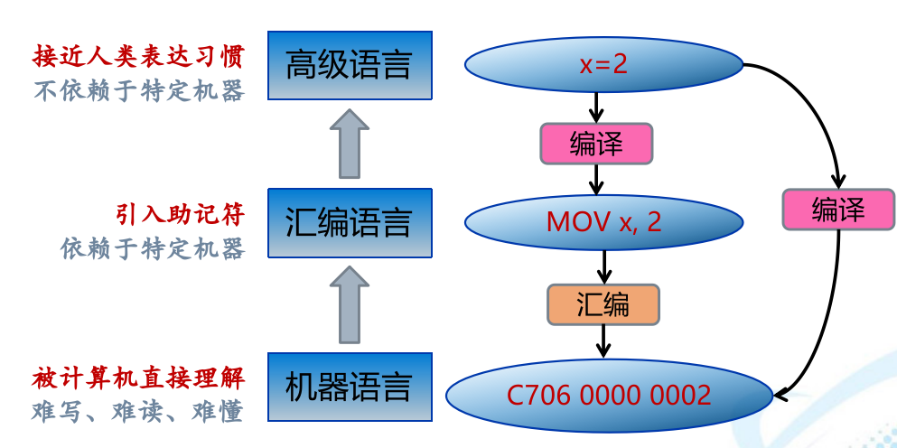
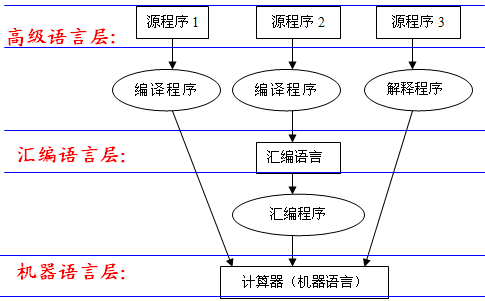
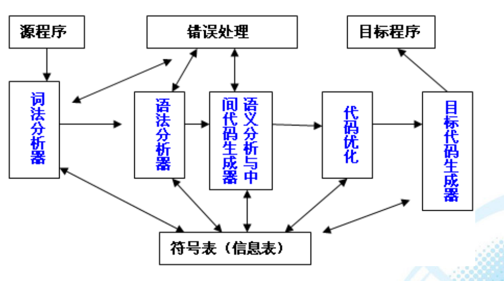
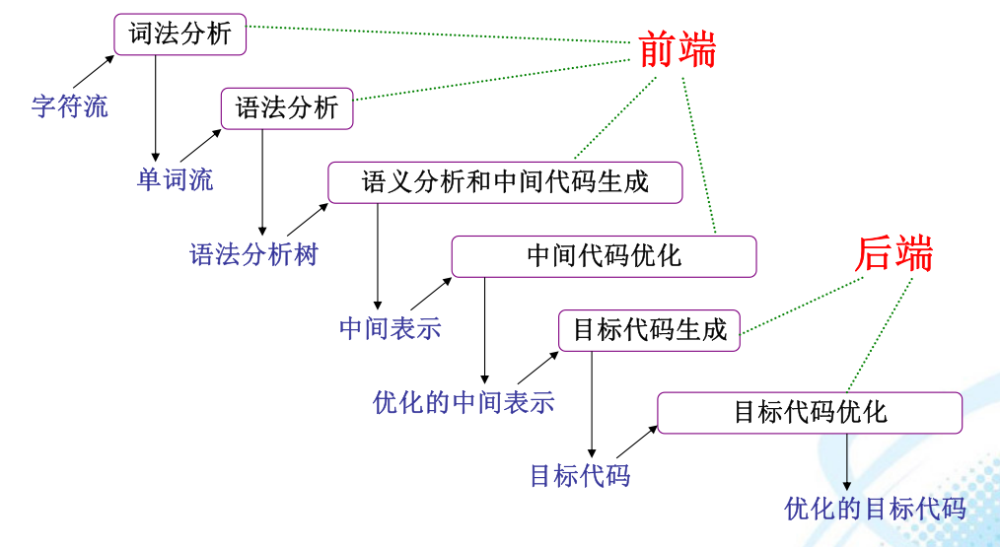

# 编译原理概述
计算机语言的发展经历了机器语言、汇编语言、高级语言三个时期，机器语言面向于机器，可以被机器直接识别；

汇编语言依赖于计算机抽象出来的一种符号语言，是机器指令系统的符号化，具有宏指令功能的面向机器语言；

高级语言则面向人，不能直接在机器上运行，必须经过一个翻译过程。

## 翻译
一种语言程序（源程序，翻译加工的对象）转换成另一种等价的语言程序（目标程序，翻译加工的结果）。

### 编译程序
将源程序翻译成等价的目标程序（汇编语言或机器语言）

### 解释程序
按源程序中语句动态顺序，边解释，边执行。

### 汇编程序
将汇编语言编写的程序翻译成机器指令序列。

## 编译方式与解释方式
**编译方式与解释方式的区别在于是否生成目标代码。**
### 编译方式
源程序翻译成等价的目标程序（汇编语言，机器语言）

### 解释方式
对源程序的每一个语句边解释，边执行，不产生目标程序。

## 编译的五个阶段
### 词法分析
识别单词。从左至右一个字符一个字符对源程序的字符流进行扫描和分解，识别并输出一个个单词以及单词的属性（关键字，标识符，常数，运算符，界符）

输入源程序->单词符号序列

#### 单词识别规则
识别单词是按语言的词法规则或叫构词规则进行的，描述词法规则的有效工具是**正规文法**和**正规式**。
### 语法分析
根据语法规则，把单词符号序列分解成各类语法单位（程序、语句、表达式等），分析源程序的结构，判别是否为相应程序设计语言中的一个合法程序。

输入单词符号序列->各类语法单位

描述语法规则的有效工具是上**下文无关文法**。
### 语义分析和中间代码生成
理解语句的意思。
编译可以判断类型错误等，但它并不知道程序要做什么

一般不直接将程序翻译成目标语言，而是先生成与机器无关的中间代码。

中间代码是等价于源程序的各类中间表示形式，主要作用是建立源语言和目标语言之间的桥梁，避开二者之间较大的语义跨度,以利于相关分析和编译过程中各遍的实现。**中间代码对程序做了部分翻译，它把语句动作进行了分解，分解成一个一个的简单动作。**

**常用表示形式：**
四元式(运算符，第一操作数，第二操作数，结果)、三元式、间接三元式、三地址码、逆波兰式等
### 中间代码优化
对中间代码进行加工变换，以产生出更为高效（省时间、空间）的目标程序。
代价：编译时间长。
优化包括：**局部优化，循环优化**。
代码优化也称为与机器有关的优化。
#### 局部优化
1. 删除公共子表达式
2. 删除无用代码
3. 合并已知量
#### 循环优化
1. 代码外提
2. 强度削弱
3. 删除归纳变量
### 代码生成

## 遍
指对源程序或源程序的中间形式（如单词，中间代码）从头到尾扫描一次，并作相应的加工处理，称为一遍

①计算机存储器的大小；\
②程序语言的简繁；\
③解决实际问题的范围；\
④设计人员的多少

