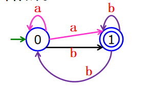
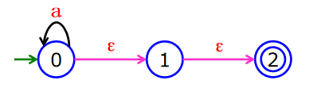
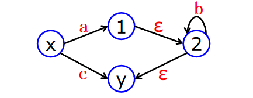
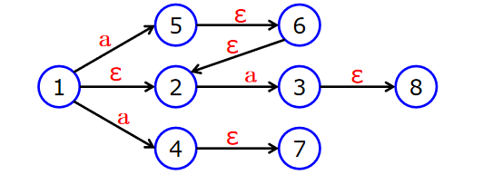
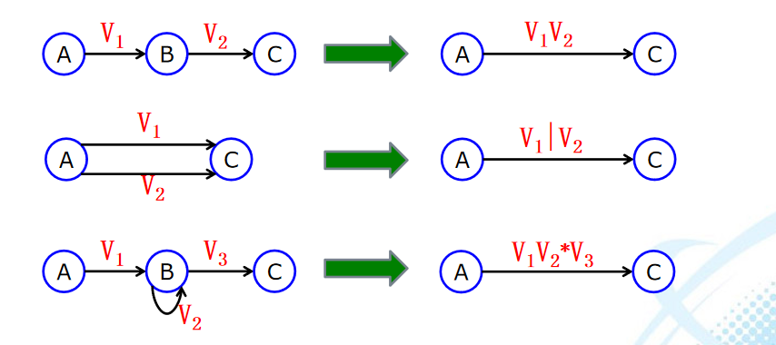

# 词法分析
读入源程序的字符流，按构词规则识别出具有独立意义的词法单位(单词)
同时，指出单词的属性（标识符、保留字、常数、…），
并进行词法检查。
输入： 字符流（源程序）
输出： 二元式（单词种别，单词属性值），单词流，用于语法分析
任务： **识别字符串、确定字符串种类**。

## 状态转换图
使用状态转换图是设计词法分析程序的一种好途径。
状态转换图是一个有限方向图。
结点代表状态（用○表示），结点间用箭弧线连接($\rightarrow$)，箭弧线上的符号，表示射出结点到达射入结点可能出现的输入符号，终态结点代表分析结束。

**注：** 一个状态转换图只包含**有限个状态**（即有限个结点），其中一个被认为是**初态**；而且至少要包含一个**终态**。

**词法分析的实现：**

    对应每个状态转换图中不同的情况进行不同的处理： 
    每个状态对应一段子程序； 
    对不含回路的分叉可以对应一组case语句或if … then …
    对于含有回路的结点应对应循环语句while和if。

## 正规表达式与有限自动机
$\sum$中的符号为正规式的基本符号，单个符号或由符号与运算符组成的表达式称正规式。 例：a，ab*，a|b ，(a|b)c 都是正规式

由正规式所表示的字符串的集合称为正规集。若正规式用V表示，则正规集L(V)表示。

### 要点

1. ε 和 $\phi$ 都是Σ上的正规式，它们所表示的正规集分别为 { ε }和$\phi$
2. $\forall a \in \sum$ , a是在$\sum$上的正规式，其正规集为{$a$}
3. U、V是在$\sum$上的正规式，其正规集为L(U)、L(V)，则：
   1. $U \bigcup V、UV、(U)^*$也是正规式，它们所表示的正规集分别为$L(U)\bigcup L(V)、L(U)L(V)、(L(U))^*$

4. 仅由有限次使用上述三个步骤而得到的表达式才是Σ上的正规式，仅由这些正规式所表示的字符集才是Σ上的正规集。

若两个正规式代表的正规集相同，则认为两个正规式等价。
$$
U = V , 表示L(U) = L(V)
$$

### 运算规则
$$
U|V = V|U \\
U|(V|W) = (U|V)|W   \\
U(VW) = (UV)W       \\
U(V|W) = UV|UW     \\
εU = Uε= U  \\
U*=U+|ε \\
U^{**}=U^{*}  \\
U^{+}=U^{*}U=UU^{*} 
$$
#### 选择规则 U|V
$$
L(U|V)=L(U)\bigcup L(V)
$$
#### 连接规则 UV
$$
L(U|V)=L(U)L(V)
$$
#### 重复规则 $U^*$
$$
L(U^*)=(L(U))^*
$$

## 有限自动机
一种具有有限个状态的转移系统。

表现形式：
1. 状态图
2. 状态转换矩阵
### 确定有限自动机（DFA）
确定有限自动机（DFA M）是一个五元组：$DFA(M)=(S,\sum,\delta,S_0,F)$
S是一个有限集，它的每个元素称为一个状态（自动机所有状态的集合）。

$\sum$是一个有穷字母表，它的每个元素称为一个输入字符。

$\delta$是一个从$S\times \sum \rightarrow S$的单值映射。$\delta (S,a)=S'$意味着：当现行状态为S、输入字符为a时，将转换到下一个状态S′。称S′为一个后继状态。

$S₀ \in S$ 唯一的初态。（仅有一个初态）

$F \subseteq S$ 一个终态集。（可有多个终态）

#### DFA M所识别的符号串α
设字符串 $\alpha \in \sum*$，若存在一条从初态到终态的通路，且这条道路上所有弧线标记符号连接成的符号串恰好是α ，则称α为DFA M所识别。

如果DFA M的初始状态又是终态，则空串$\epsilon$可被DFA M识别。
### 非确定有限自动机（NFA）
某一结点射出多条标记相同的弧线到达不同的结点:

某一结点射出标记有ε字符的弧线。

一个非确定的有限自动机(NFA M)是一个五元组:
$NFA(M) = (S,\sum,\delta,S₀,F)$
其中S和$\sum$的含义同DFA；

δ是一个从$S\times \sum*$到S的子集的映射，即$\delta: S\times \sum* \rightarrow 2ˢ $；
$S₀ \subseteq S$，是一个非空初态集；
$F \subseteq S$，是一个终态集（可空）。

NFA M状态转换函数具有多值性；即$\delta (S,a) = \{S_1,S_2,···,S_n\} $
NFA M可以存在ε弧；
NFA M可以有多个初态（初态集）

DFA是NFA的特例，对于每个NFA M 都存在一个DFA M’，使：L(M)=L(M’)

### 非确定有限自动机的确定化
目的：
   1. 消除识别$\epsilon$到达的状态结点；
   2. 合并识别相同字符到达的状态结点。
#### ε-CLOSURE(I)闭包
设I是NFA M状态集的一个子集:
I的ε-CLOSURE(I)闭包:
$$
    S\in ε-CLOSURE(I) \\
    \delta(S,\epsilon^*)=S',S'\in  ε-CLOSURE(I)
$$
示例：

1. 若I={x,1},则
  $$
    ε-CLOSURE(I) = \{ x,1,2,y \}
  $$
2. I={x,2},则
  $$
    ε-CLOSURE(I) = \{ x,2,y \}
  $$
#### Iₐ的定义
假定I是NFA M状态集中的一个子集，a是$\sum$中的一个字符，Ia的定义:

##### 示例

若I={1},则：
$Iₐ = ε-CLOSURE(\delta(I,a)) = \{5,4,2,6,7\}$

### DFA的化简
1. 划分终态集和非终态集
2. 每个状态集构造新的划分，对每个字符a,求Iai(Ii表示化简到某个过程时的状态集中的某个子集），用a作为检测方法

## 正规文法与NFA的对应关系
可根据NFA产生出其对应的正规文法；
也可根据正规文法画出对应的NFA。
### 从NFA到正规文法
设有正规文法$G=(V_N,V_T,S,P)$
$V_N$对应于NFA的S（即状态集）；
$V_T$对应于NFA的$\sum$（即输入字母表）；
S对应于NFA的$S₀$（开始符号）
产生式的规则P：

### 从正规文法到NFA
由文法G=(VN,VT,S,P)构造NFA，主要是由产生式P构造状态转换函数。
步骤：

若$\alpha$由若干个$V_T$构成,则增加中间状态逐个识别 ,如$\alpha$=ab,则:$\delta(A,a)=T,\delta(T,b)=B$

