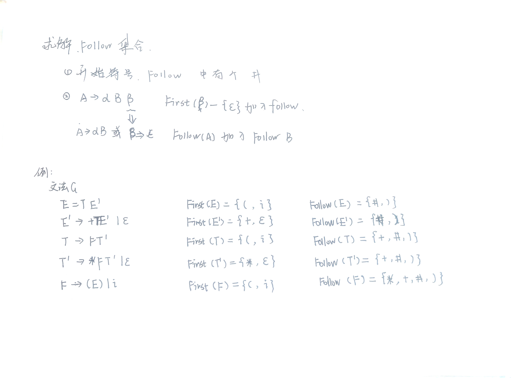

# 语法分析
语法分析是编译过程的核心部分。语法分析的任务是分析一个文法的句子结构，
## 自上而下分析方法（推导） 实质：试探法
就是从文法的开始符号出发，每次选择一个产生式，用右部代替左部的逐步推导的过程。
### 消除左递归
#### 消除直接左递归($P\rightarrow P\alpha$)

可化作：

#### 消除间接左递归($P\rightarrow Ab,A\rightarrow C,C \rightarrow P$)
先转为直接左递归再消除！
对非终结符排序的不同，最后得到的文法在形式上可能不一样，但它们等价的。

### 消除回溯
在候选式的首字符集中有相同的字符，因此不能确定用哪个候选式
提取公因子，例如
$S\rightarrow aA|aB$
提取公因子后变成了
$
    S\rightarrow aS' \\
    S' \rightarrow A|B
$

### LL(1)分析法
自左向右、产生最左推导、每次推导只能向前查看一个字符
条件：
1. 不包含左递归
2. 候选首字符集两两不相交
#### FIRST集
符号能推导出的第一个终结符号（include $\epsilon$）的集合。
#### Follow集
FOLLOW(A)为所有句型中紧跟在非终结符A后面的所有终结符集合或“#”。

#### 预测分析表
（1）对每个终结符a∈FIRST（a），将A->a加到预测分析表中。
（2）如果ε∈FIRST（A），则对于任何b∈FOLLOW（A），将A->a加到预测分析表中。

## 自底向上分析（归约）
每次在句型中选择一个可归约的串，用产生式左部来代替它，逐步归约到文法的开始符号。
### 基本概念
#### 短语
#### 直接短语
短语中不包含更小的直接短语
#### 句柄
最左直接短语

### 算符优先分析法
故算符之间存在一种优先关系，因此有算法优先分析法，即定义算符之间的优先关系，利用这种优先关系进行分析。
在算法文法G中，任何一对终结符a,b之间的优先关系为：
|优先级|介绍|
|--|--|
|$a=b$|当且仅当有产生式P→···ab···或P→···aAb···，$A \in V_N$|
|$a<·b$|$P\rightarrow ···aA···，A^+\Rightarrow b··· 或者 A^+\Rightarrow Bb···$|
|$a·>b$|$P\rightarrow ···Ab···，A^+\Rightarrow ···a 或者 A^+\Rightarrow ···aB$|
算符优先文法讨论的是终结符之间的优先关系。

#### FIRSTVT
由非终结符P所能推出的所有串中**第一个终结符**的集合（若第一个是$V_N$则还包括紧跟在$V_N$后的第一个$V_T$）
##### 构造方法
**规则1:** 按定义，若有产生式$P\rightarrow a··· 或P→\rightarrow Qa···，则a\in FIRSTVT(P)$
**规则2:** $如果 a\in FIRSTVT(Q)，并且P\rightarrow Q··，则a\in FIRSTVT(P)$

#### LASTVT
由P所推出的串的**最后一个终结符**的集合（若最后一个是$V_N$则还包括此$V_N$前边的一个$V_T$）
##### 构造方法
**规则1:** 按定义，若有产生式$P\rightarrow ···a 或P→\rightarrow ···aQ，则a\in LASTVT(P)$
**规则2:** $如果 a\in LASTVT(Q)，并且P\rightarrow ··Q，则a\in LASTVT(P)$

$若有产生式的候选式为 ···aP···，对任何b\in FIRSTVT(P)，则有a<·b$
$若有产生式的候选式为 ···Pa···，对任何b\in LASTVT(P)，则有b·>a$

#### 构造优先关系表
①将文法中所有的终结符和#作为关系表的行标和列标。
②当文法中有$A→···ab···或A→···aQb··· $时，$（Q\in V_N, a,b\in V_T)$，则置a≖b。特别#≖#。
③**按行求：**  行后，FIRST，置小
$$若有产生式的候选式为 ···aP···，对任何b\in FIRSTVT(P)，则有a<·b$$
④**按列求：**  列前，LAST，置大
$$若有产生式的候选式为 ···Pa···，对任何b\in LASTVT(P)，则有b·>a$$
⑤对左边的开始符#,对所有的$a\in FIRSTVT(S)$,置#<.b
  对右边的结束符#，对所有的$a\in LASTVT(S)$,置a.>#

**算符文法（二义性文法）不一定是算符优先文法。
若所有终结符之间的优先关系都是唯一的，则文法是算符优先文法。**

#### 算法优先分析算法
分析开始时，栈底放一个“#”，输入串之后放一个“#”；令θ代表从栈顶往下的第一个终结符号；a存放新读入的符号。算法基本步骤为：
①把下一个输入符号读至a中，
②若θ·>a：从栈顶往下进行相应的归约处理，归约后的符号进栈，重新进入步骤
③若θ=a：θ=a=#，则分析结束； 其他：将a入栈，转①。
④若θ<·a：将a移入栈，转①。
⑤若θ与a不存在优先关系，则出错。

无法发现由单个非终结符构成的“可归约串”。

#### 几个概念
**素短语**：某句型的素短语是一个短语，它至少包含一个终结符，并且除了它自身以外，不再含有任何更小的素短语。
**最左素短语**：位于句型最左边的素短语。

### LR分析法
从左（Left,L）向右扫描输入串，构造一个最右推导（Rightmost,R）的逆过程
进行规范归约（最左归约），每次归约的都是真正的句柄；

#### LR分析法的基本原理
1. 把每个句柄的识别过程划分为若干状态，每个状态从左至右识别句柄中的一个符号，若干个状态就识别句柄的一部分符号。 
2. 识别了句柄的一部分符号就相对于识别了当前规范句型的左起部分——这一部分称为规范句型的活前缀。
3. **活前缀**：规范句型的一个前缀，它不包含句柄之后的任何符号。 