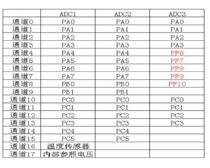
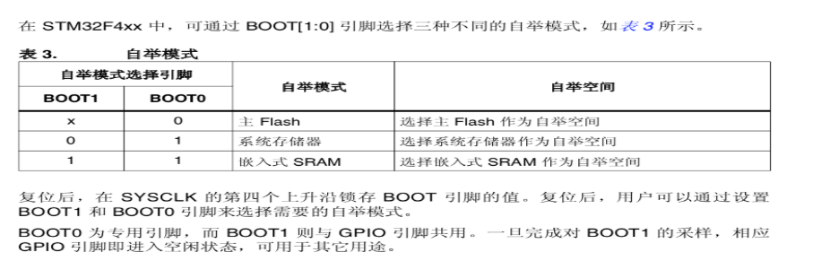
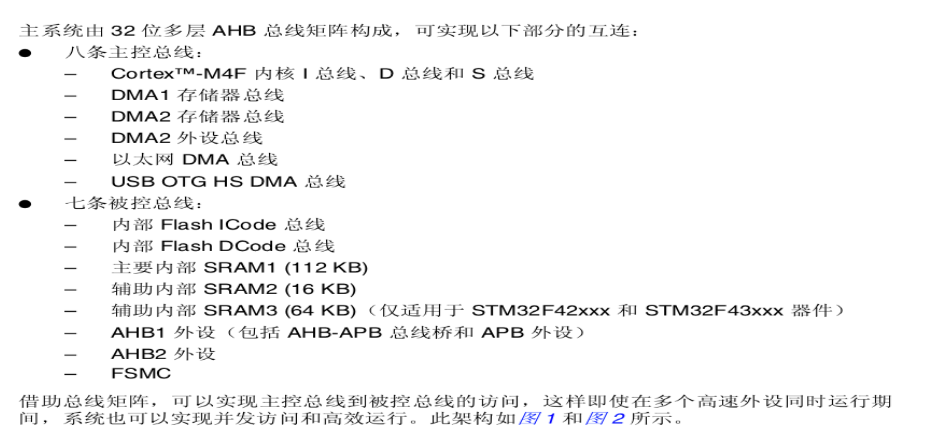

# STM32
内核为arm公司的Cortex-M、标准的arm架构、针对高性能、低成本、低功耗的嵌入式应用、简单易用：具有丰富的固件库函数
## Cortex内核
## STM32F407ZGT6资源
### Kernel 内核
32位高性能arm Cortex-M4处理器、168MHz、支持支持FPU（浮点运算）和DSP指令
### IO接口
144个引脚（其中114个IO大部分IO口都耐5V）、支持调试：SWD和JTAG，SWD只要2根数据线
### 存储器容量
1024K FLASH，192K SRAM
### AD


-3 个12 位 AD【多达24个外部测量通道】\
-内部通道可以用于内部温度测量\
-内置参考电压
### 低功耗
-睡眠，停止和待机三种低功耗模式\
-可用电池，为RTC和备份寄存器供电
## STM32存储器组织结构
MEM与IO统一编制、小端模式存储\
程序存储器、数据存储器、寄存器和 I/O 端口排列在同一个顺序的 4 GB 地址空间内。\
各字节按小端格式在存储器中编码。即，字中编号最低的字节被视为该字的最低有效字节，而编号最高的字节被视为最高有效字节。\
可寻址的存储空间分为 8 个主要块，每个块为 512 MB。未分配给片上存储器和外设的所有存储区域均视为“保留区”。

# MDK下C语言复习
## 位操作
|操作符|含义|
|-----|----|
|&|按位与|
|\||按位或|
|^|按位异或|
|~|取反|
|<<|左移|
|>>|右移|
DEMO：
```
GPIOA->ODR |=((uint32_t) 0x01)<<5;   
// 其中 ” |=”是一个复合赋值运算符
GPIOA->ODR =(((uint32_t) 0x01)<<pinpos);  
// 将 ODR 的 pinpos 位置 1
GPIOA->BSRRL &=0xFF0F;        
// 将 4~7 位清零
TIMx->SR = (uint16_t)~TIM_FLAG;
```
## 结构体
```
struct 结构体名{
成员变量1；
成员变量2；
…
…
}结构体变量列表；
```

# 作业内容
## 何谓单片机、嵌入式？
单片机：将微机（或计算机）的基本组成**集成**在芯片中。微机的基本组成包括：CPU、存储器、I/O设备和总线。

嵌入式：将微机系统集成在芯片中。微机系统包括：微机的基本组成部分、外设、BIOS或固件库函数、嵌入式操作系统和应用程序。

## 比较芯片的“能耗”和“功效”时，须要考虑哪些因素？
比较“能耗”： 是在相同的处于工作状态电路规模（有多少门）和工作频率的前提下，比较芯片的功耗。

比较“功效”：是在相同功耗和芯片的制作工艺的前提下，比较芯片的运行速度。
## Cortex-M4与Cortex-M3相比，增加了哪些功能？（或提高了哪些性能？）
RMCortexM4处理器是在M3的基础上强化了运算能力：新加了浮点、DSP、并行计算等，用以满足需要高效且易用的控制和信号处理功能兼备的数字信号控制市场。
## STM32 的3种低功耗模式的区别？ 
睡眠模式：CM3内核停止，所有外设及其时钟正常工作\
停止模式：所有时钟都停止\
待机（standby）模式：1.8V内核电源关闭，从待机模式唤醒后的代码执行等同于复位后的执行。
## 缩略词
|序号|缩略词|全英文|中文名称|
|-|--|--|--|
1|ARM|Advanced RISC machines	|高级精简指令集处理器
2|RISC|Reduced Instruction Set Computer|精简指令集计算机
3	|CISC	|Complex Instruction Set Computer	|复杂指令集计算机
4	|CMSIS|	Cortex Microcontroller Software Interface Standard	ARM Cortex™ |微控制器软件接口标准
5	|DSP	|Digital Signal Processing|	数字信号处理
6	|DMIPS	|Dhrystone Million Instructions executed Per Second	|每秒钟运行xx百万条指令。
7	|Cortex	|--------	|ARM旗下的一个处理器系列名称
8|	FIFO	| First Input First Output|	先进先出
9|	DMA|	Direct Memory Access	|直接内存存取
10|	SRAM|Static Random-Access Memory|静态随机存取存储器
11|	FSMC|Flexible Static Memory Controller|可变静态存储控制器
12|	ADC	|analog to digital converter|	模数转换器
13|	DAC	|Digital to analog converter|	数模转换器
14|	USATR|	Universal Synchronous/Asynchronous Receiver/Transmitter|	通用同步/异步串行接收/发送器
15|	SPI	|Serial Peripheral Interface	|串行外设接口
16|	JTAG	|Joint Test Action Group|	联合测试工作组
17|	GPIO|	General-purpose input/output	|通用型之输入输出
18|	LQFP	|Low-profile Quad Flat Package|	薄型四方扁平式封装技术
19|	UFBGA	|Ultra Fine Ball Gird Array	|极精细球栅列封装
20|	FPU	|Float Point Unit|	浮点运算单元
21|	DSP	|Digital Signal Processing|	数字信号处理
22|	SWD|	Serial Wire Debug	|串行调试
23|	FLASH|	Flash Memory|	闪存
24|	UART|	Universal Asynchronous Receiver/Transmitter|	通用异步收发传输器
25|	SPI	|Serial Peripheral Interface|	串行外设接口
26|	SDIO|	Secure Digital Input and Output|	安全数字输入输出卡
27|	AHB|	Advanced High-performance Bus	|高级高性能总线
28|	APB	|Advanced Peripheral Bus|	外围总线
29|	SOC	|System on Chip|	系统级芯片
30|	RCC	|Reset Clock Controller|	复位与时钟控制器
31|	RNG	|Random Numeral Generator	|随机数生成器
32|	PSARM|	Pseudo static random access memory	|伪静态随机存储器
33|	RTC|	Real_Time Clock	|实时时钟
34|	IWDG|	Internal Watchdog|	独立看门狗
35|	WWDG|	Windowed Watchdog |	窗口看门狗

## STM32 内部AHB1、AHB2、AHB3、和APB1、APB2总线的最高速度如何？分别连接着哪些接口和外设？
AHB1,AHB2,AHB3：最高工作频率168MHz；  APB1：最高42MHz   ；APB2：最高84MHz\
连接在 AHB1 总线上有：GPIOA、GPIOB、… 、 GPIOH、RCC、Flash 接口寄存器、DMA/FIFO、USB OTG HS、Ethernet MAC, 8 Streams FIFO。\
连接在 AHB2 总线上有：USB OTG FS、Camera interface/DCMI, RNG, HASH, CRYD；\
连接在 AHB3 总线上有：FSMC,SRAM,PSARM,NOR FLASH,PC Card(ATA),NAND FLASH\
连接在 APB1 总线上有：TIM2/3/4/5/6/7/12/13/14、USART2/3、UART4/5、 SPI2/I2S2 、 SPI3/I2S3、 I2C1/2/3/SMBUS、bXCAN1/2、DAC1/2、RTC、IWDG、WWDG；\
挂接在 APB2 总线上：EXTIT/WKUP、SDIO/MMC、TIM1/8/PWM、TIM9/10/11、USART1/6、SPI1、ADC1/2/3、Temperatrue sensor

## STM32 内部GPIOx、TIMx、ADC、DAC分别是多少个、每一个是多少位的？
GPIOx：GPIOA…GPIOG 16位 (7个) GPIOH 2位(个) 共8个。（共16*7+2=114个I/O线）\
TIMx：共14个高级控制定时器。其中TIM2和TIM5是32位，其余均为16位。\
ADC：3个8位或12位A/D转换器（共24输入通道）\
DAC：2个12位D/A转换器

## STM32引脚中的BOOT1在哪里？引脚中的BOOT0、 BOOT1有何作用？（STM32可以有哪几个自举空间?)
BOOT1和PB2共用，即48脚。

## STM32芯片内部总线构架的特点和优越性。
芯片内部总线构架：总线矩阵\
总线矩阵作用：实现主控总线到被控总线的访问。\
总线矩阵优越性：实现在多个高速外设同时运行期间，并发访问和高效运行。

## STM32存储空间和IO空间是如何编址的？总共有多大的寻址空间？采用什么方式存储指令或数据的高字节和低字节？STM32芯片内嵌入的存储器有多大空间？“保留”区域有什么用？
在STM32F407中，程序存储器、数据存储器、寄存器和 I/O 端口地址排列在同一个、顺序的 4 GB 地址空间内。采用的是“统一编址”。

在STM32F407中，数据或代码按小端格式在存储器中存放。即字中地址编号最小的字节被视为该字的最低有效字节，而地址编号最大的字节被视为最高有效字节。

STM32芯片内嵌入的存储器：1024KByte FLASH ROM，192KByte SRAM
“保留”区域的作用是，1.为后续系统扩展做准备； 2.在芯片内部结构不变化，为芯片升级留有余地；3、升级时方便实现兼容。


