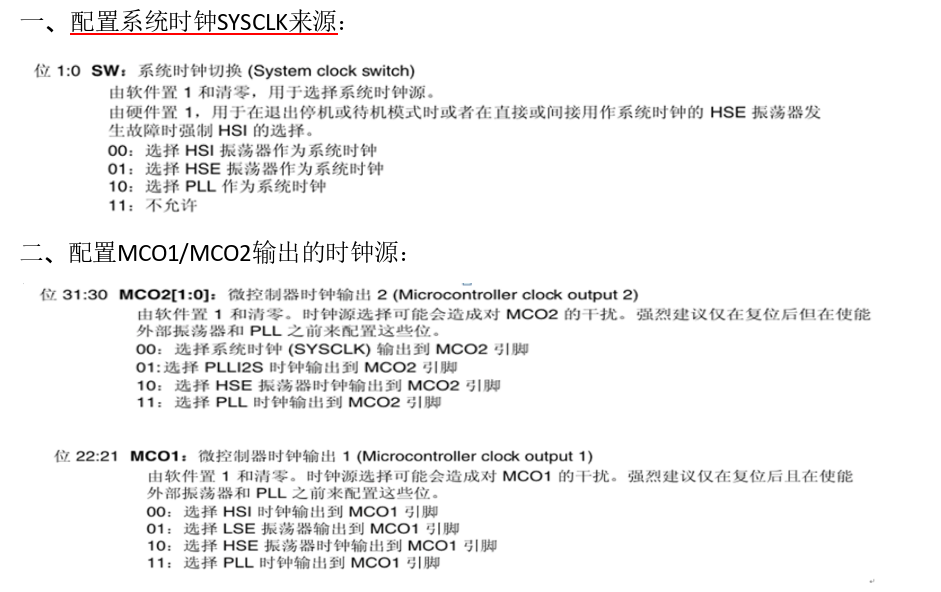
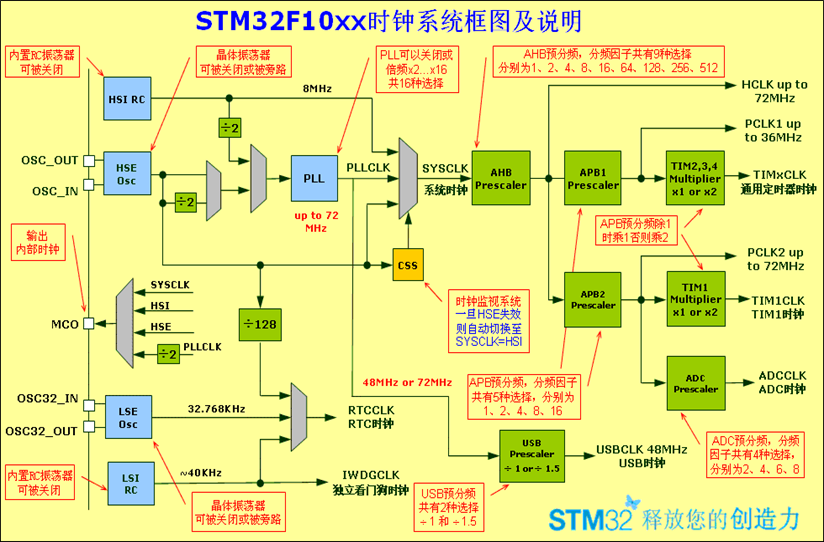

# STM32F4时钟系统
RCC，Reset and Clock Control（复位和时钟控制），在绝大部分MCU芯片中都包含复位和时钟控制模块，也是MCU重要的组成部分。

STM32F4  有5个时钟源:HSI、HSE、LSI、LSE、PLL。
 
① LSI是低速内部时钟，RC振荡器，频率为32kHz，提供低功耗时钟。主要供独立看门狗和自动唤醒单元使用。

② LSE是低速外部时钟，接频率为32.768kHz的石英晶体。提供给RTC做时钟源。 

③ HSE是高速外部时钟，可接石英/陶瓷谐振器，或者接外部时钟源，频率范围为4MHz～26MHz。主要供SYSCLK和RTC使用。

④ HSI是高速内部时钟，RC振荡器，频率为16MHz，精度不高。可以直接作为系统时钟或者用作PLL时钟输入。 ⑤ PLL为锁相环倍频输出。STM32F4有两个PLL: 

⑤ PLL为锁相环倍频输出。STM32F4有两个PLL:\
主PLL(PLL)由HSE或者HSI提供时钟信号，并具有两个不同的输出时钟。\
第一个输出PLLP用于生成高速的系统时钟（最高168MHz）\
第二个输出PLLQ用于生成USB OTG FS的时钟（48MHz），随机数发生器的时钟和SDIO时钟。\
专用PLL(PLLI2S) 生成精确时钟，用于在I2S接口实现高品质音频。

# SysTick定时器
系统滴答定时器、一个24位的倒计数定时器，计到0时，将从RELOAD寄存器中自动重装载定时初值。只要不把它在SysTick控制及状态寄存器中的使能位清除，就永不停息，即使在睡眠模式下也能工作。

SysTick定时器被捆绑在NVIC中，用于产生SYSTICK异常（异常号：15）。\
SysTick中断的优先级也可以设置。

##
自由运行时钟(free running clock)FCLK

HCLK ：AHB总线时钟

FCLK,提供给CPU内核的时钟信号,CPU的主频就是指这个信号; 

HCLK,提供给高速总线AHB的时钟信号; 

PCLK,提供给低速总线APB的时钟信号;

## 相关寄存器
|||
|-|-|
|CTRL|SysTick控制和状态寄存器|
|LOAD|SysTick重装载初值寄存器|
|VAL|SysTick当前值寄存器|
|CALIB|SysTick校准值寄存器|

## 作业
### 缩略词
**序号** | **缩略词** | **英文全称**            | **中文释义 **                       
--------|---------|---------------------|---------------------------------
 **1**  | HSI     | High Speed Internal | 高速内部时钟信号                        
 **2**  | HSE     | Hign Speed External | 高速外部时钟信号                        
 **3**  | LSI     | Low Speed Internal  | 低速内部时钟信号                        
 **4**  | LSE     | Low Speed External  | 低速外部时钟信号                        
 **5**  | PLL     | Phase Locked Loop   | 锁相环倍频输出                         
 **6**  | IWDG    | Internal Watchdog   | 独立看门狗                           
 **7**  | DLL     | Delay\-Locked Loop  | 延迟锁相环                           
 **8**  | RTC     | Real\_Time Clock    | 实时时钟                            
 **9**  | OTG     | On The Go           | 一种近几年发展起来的新技术，主要应用于各种不同设备之间的连接  

### STM32F407有哪5个时钟源？
### 系统时钟、RTC、芯片时钟输出、PLL时钟分别可以选用哪些时钟源？
系统时钟SYSCLK：可以选用PLLCLK\HSE\HSI做时钟源；\
RTC： 可以选用HSE\LSE\LSI做时钟源；\
芯片时钟输出：MCO1：HSI\ LSE\ HSE\ PLLP\
MCO2：LSE\ HSE\ SYSCLK\ PLLI2CLK;\
PLL：可以选用HSE\HSI做时钟源.
### 如何配置系统时钟SYSCLK来源？如何配置MCO1/MCO2输出的时钟源？ (只写出相关寄存器名字、和位段的二进制值)
两个配置在RCC时钟配置寄存器RCC_CFGR中完成。

