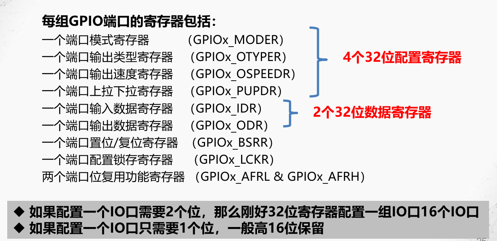

# GPIO
GPIOA/B/C/D/E/F/G,一共16X7=112个IO\
GPIOH.0,  GPIOH.1 外加这2个IO\
一共114个IO口
 
## GPIO工作方式

### 输入
输入浮空、输入上拉、输入下拉、模拟（输入）、复用（输入）
### 输出
开漏式输出、推挽式输出、模拟（输出）、复用（输出）

最大输出速度：2MHZ、25MHz、50MHz、100MHz 
#### 推挽输出
两个MOS管都激活。可以输出强高\低电平，驱动数字器件。
#### 开漏输出
仅N-MOS管激活。只可以输出强低电平，高电平得靠外部电阻拉高。
要得到高电平状态需要上拉电阻。
### 复用
### 模拟

## 相关寄存器

如下图，左边这个32为地址，即为GPIOC的所有寄存器的**基地址**

### 端口位复用功能寄存器

## 作业
### 写出以下寄存器的32位地址：GPIOI_MODER、GPIOH_OTYPER、GPIOG_PUPDR。
答：在中文参考手册P53（查找基地址），在P192/193中（查找偏移地址）

GPIOI_MODER：GPIOI的基地址 ＋MODER的偏移地址=0x4002 2000＋00  =0x4002 2000

GPIOH_OTYPER：GPIOH的基地址 ＋OTYPER的偏移地址=0x4002 1C00＋04 =0x4002 1C04

GPIOG_PUPDR：GPIOG的基地址 ＋PUPDR的偏移地址=0x4002 1800＋0C  =0x4002 180C

### 请查到并写出以下片内外设或接口的相关寄存器端口基地址:RCC_XX、U(S)ARTx_XX、EXTI_XX 、TIMx_XX、RTC_XX、IWDG_XX、ADCx_XX、DACx_X、SPIx、I2Cx_XX。（不用写出）会找到它们各自的若干个寄存器的偏移地址、会推算出32位地址。
RCC_XX：    0x4002 3800 \
USART6_XX： 0x4001 1400\
EXTI_XX：    0x4001 3C00\
TIM4_XX：   0x4000 0800\
RTC_XX：    0x4000 2800\
IWDG_XX：  0x4000 3000\
ADC1_XX：  0x4001 2000\
SPI4_XX：   0x4001 3400\
I2C1_XX：   0x4000 5400

### GPIO有哪些相关寄存器，其中GPIOx_MODER/ GPIOx_AFRL的作用分别是什么？
GPIOx_MODER；GPIOx_OTYPER；GPIOx_OSPEEDER；GPIOx_OSPEEDER；
GPIOx_PUPDR；GPIOx_IDR；  GPIOx_ODR； GPIOx_BSRR；  GPIOx_LCKR；  GPIOx_AFRL； GPIOx_AFRH。

### “STM32F407ZGT6.PDF数据手册”P56-60及P44～P55，找出以下信号，占用哪些个GPIO线？
1）USART3_TX、USART3_RX、USART3_CK分别占用：PD8/PD9/PD10; 或PC10/PC11/PC12;或PB10/PB11/PB12;\
2）TIM14_CH1占用：PA7或PF9;\
3）I2C2_ SDA、 I2C2_ SCL  分别占用：     PB11/PB10; 或PH5/PH4; 或PF0/PF1;\
4）SPI1_SCK、SPI1_MISO、SPI1_MOSI分别占用：PB3/PB4/PB5; 或PA5/ PA6/ PA7\
5）ADCx_IN3、DAC1_OUT  分别占用：PA3/ PA4
