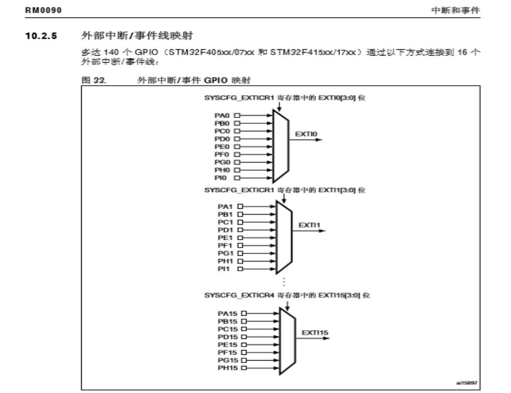
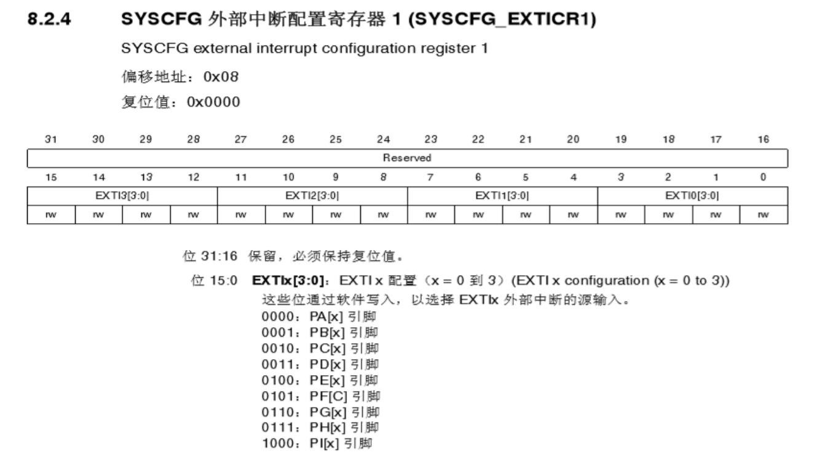
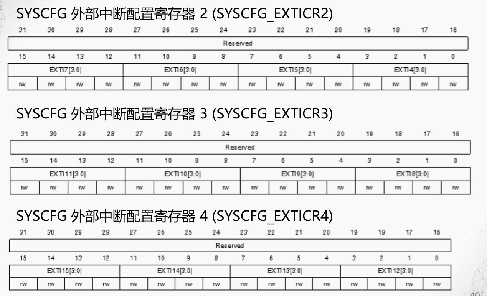
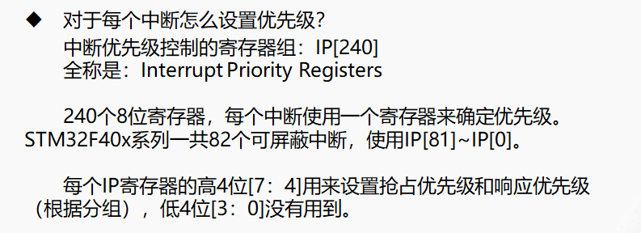
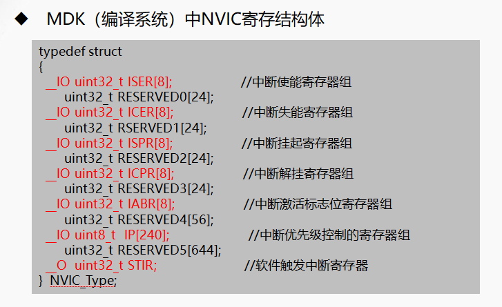
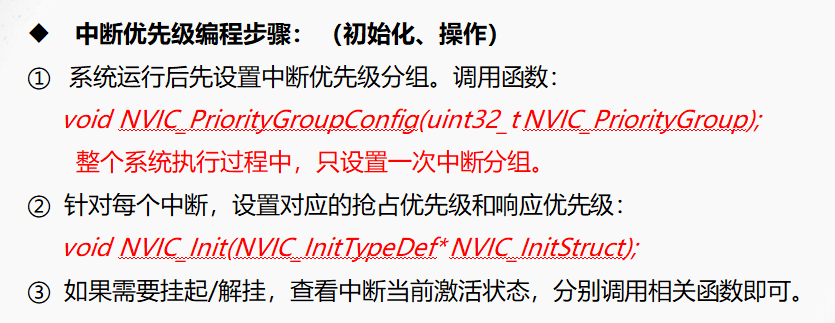
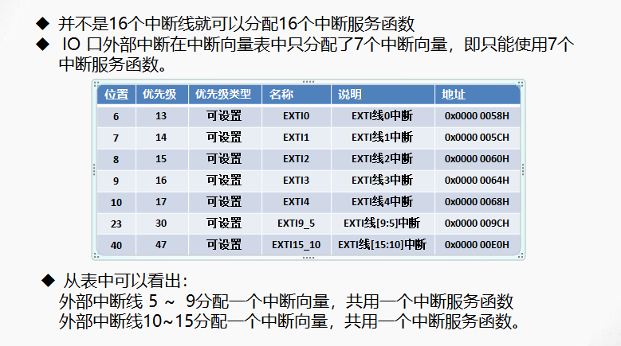
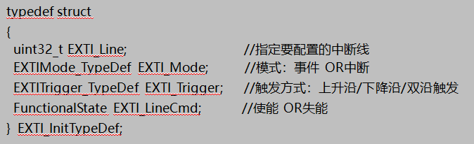
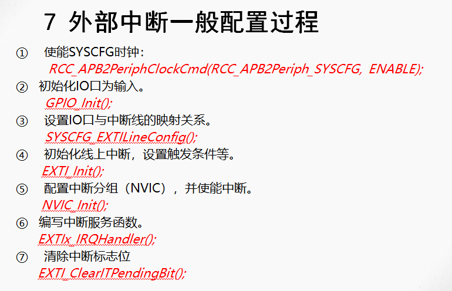

# NVIC中断
NVIC和处理器内核紧密相连，用于总体管理异常，称之为“内嵌向量中断控制器： Nested Vectored Interrupt Controller (NVIC)"。

CM3/4内核支持256个中断，其中包含了16个内核中断和240个核外中断。
具有256级的可编程中断设置。

STM32F4并没有使用CM4内核的全部中断，而是只用了它的一部分。\
    -STM32F40xx/STM32F41xx总共有92个中断。\
    -STM32F42xx/STM32F43xx则总共有96个中断(包括10个内核中断和82个可屏蔽中断，具有16级可编程的中断优先级，而我们常用的就是这 82个可屏蔽中断。)
## NVIC中断优先级分组
分组（*在寄存器SCB->AIRCR中配置*） -> 对每个中断设置抢断优先级和响应优先级
### 抢断优先级和响应优先级的区别
较高优先级的抢占优先级中断，可以打断正在进行的较低抢占优先级的中断；\
抢占优先级相同的中断，较高响应优先级不可以打断较低响应优先级的中断；\
抢占优先级相同的中断，当两个中断同时发生的情况下，哪个响应优先级高，哪个先执行；\
抢占优先级和响应优先级都是一样的话，则看哪个中断先发生就先执行。

| **组** | **AIRCR[10：8]** | **IP bit[7：4]分配情况** | **分配结果**                 | **优先级数**                 |
|--------|------------------|--------------------------|------------------------------|------------------------------|
| **0**  | 111              | 0：4                     | 0位抢占优先级，4位响应优先级 | 响应优先级0-15               |
| **1**  | 110              | 1：3                     | 1位抢占优先级，3位响应优先级 | 抢占优先级0-1；响应优先级0-7 |
| **2**  | 101              | 2：2                     | 2位抢占优先级，2位响应优先级 | 抢占优先级0-3；响应优先级0-3 |
| **3**  | 100              | 3：1                     | 3位抢占优先级，1位响应优先级 | 抢占优先级0-7；响应优先级0-1 |
| **4**  | 011              | 4：0                     | 4位抢占优先级，0位响应优先级 | 抢占优先级0-15               |

## 中断优先级设置
中断优先级控制的寄存器组：IP[240] 全称：Interrupt Priority Registers；240个8位寄存器，每个中断使用一个寄存器来确定优先级。

STM32F40x系列一共82个可屏蔽中断，使用IP[81]~IP[0]。
每个IP寄存器的高4位[7：4]用来设置抢占优先级和响应优先级（根据分组），低4位[3：0]没有用到。 


# 外部中断
STM32F4的每个IO都可以作为外部中断输入。stm32f4的中断控制器支持23个
外部中断请求：\
**EXTI线0~15**：对应外部IO口的输入（IN）中断。\
**EXTI线16**：连接到PVD输出。\
**EXTI线17**：连接到RTC闹钟事件。\
**EXTI线18**：连接到USB OTG FS唤醒事件。\
**EXTI线19**：连接到以太网唤醒事件。\
**EXTI线20**：连接到USB OTG HS(在FS中配置)唤醒事件。\
**EXTI线21**：连接到RTC入侵和时间戳事件。\
**EXTI线22**：连接到RTC唤醒事件。\
这些均在stm32内部产生！STM32F4供IO使用的中断线只有16个。


    GPIOx.0映射到EXTI0
    GPIOx.1映射到EXTI1
    …
    GPIOx.15映射到EXTI15

```c
void SYSCFG_EXTILineConfig(uint8_t EXTI_PortSourceGPIOx, uint8_t EXTI_PinSourcex);
      //设置IO口与中断线的映射关系
exp:     SYSCFG_EXTILineConfig(EXTI_PortSourceGPIOE, EXTI_PinSource2);
```



## 编程格式
```c
void EXTIx_IRQHandler(void)
{
    if(EXTI_GetITStatus(EXTI_Linex) != RESET)
    {
        。。。。。。。。。;    //中断服务程序的具体功能代码
        EXTI_ClearITPendingBit(EXTI_Linex);
    }

}

```

# 作业
## 总结下列知识点：（独立思考，以书面资料形式总结好）
STM32F407 有多少个中断？向量表？中断名字？服务程序名字？NVIC等优先级管理模式？ 相关寄存器和配置函数？（设置哪些内容？）NVIC优先级设置步骤？ 外部中断（EXTI）共有几个？EXTIx如何配置GPIOx引脚？EXTI还可以有哪些配置？EXTIx中断的编程步骤？

①　STM32F407 有多少个中断？

答：STM32F40xx/STM32F41xx的92个中断里面，包括10个内核中断和82个可屏蔽中断，具有16级可编程的中断优先级，而我们常用的就是这82个可屏蔽中断。

②　向量表？中断名字？服务程序名字？（自己列出所有名字和向量表中位置）

提示：中断名字，查看中文参考手册，表45，（具体列出。。。。。）；
服务程序名字：（查看工程中这个文件），内核中断XXX_Handler()，可屏蔽中断XXX_IRQHandler()（具体列出。。。。。）；
  
③　NVIC等优先级管理模式？

答：首先，对STM32中断进行分组，组0~4。
然后，对每个中断设置:   一个抢占优先级、和一个响应优先级。

④　相关寄存器和配置函数？（设置哪些内容？）



```c
NVIC_PriorityGroupConfig(NVIC_PriorityGroup_2);
设置一次中断分组。
void NVIC_Init(NVIC_InitTypeDef* NVIC_InitStruct);
void  NVIC_SetPendingIRQ(IRQn_Type  IRQn)；
uint32_t  NVIC_GetPendingIRQ(IRQn_Type  IRQn)；
void  NVIC_ClearPendingIRQ(IRQn_Type  IRQn)
uint32_t NVIC_GetActive(IRQn_Type IRQn)
```
⑤　NVIC优先级设置步骤？


⑥　外部中断（EXTI）共有几个？


⑦　EXTIx如何配置GPIOx引脚？

```c
void SYSCFG_EXTILineConfig(uint8_t EXTI_PortSourceGPIOx, uint8_t EXTI_PinSourcex);
      //设置IO口与中断线的映射关系
exp:     SYSCFG_EXTILineConfig(EXTI_PortSourceGPIOE, EXTI_PinSource2);
```
⑧　EXTI还可以有哪些配置？


⑨　EXTIx中断的编程步骤



