# RTC实时时钟
RTC是个独立的定时器。RTC模块拥有一个连续计数的计数器，在相应的软件配置下，可以提供时钟日历的功能。修改计数器的值可以重新设置当前时间和日期 RTC还包含用于管理低功耗模式的自动唤醒单元。**在断电情况下 RTC仍可以独立运行 只要芯片的备用电源一直供电,RTC上的时间会一直走。**

两个 **32 位寄存器**包含二进码十进数格式 (BCD) 的秒、分钟、小时（ 12 或 24 小时制）、星期几、日期、月份和年份。此外，还可提供二进制格式的亚秒值。**系统可以自动将月份的天数补偿为 28、29（闰年）、30 和 31 天。**

上电复位后，所有RTC寄存器都会受到保护，以防止可能的非正常写访问。

无论器件状态如何（运行模式、低功耗模式或处于复位状态），只要电源电压保持在工作范围内，RTC使不会停止工作。

## RTC特性
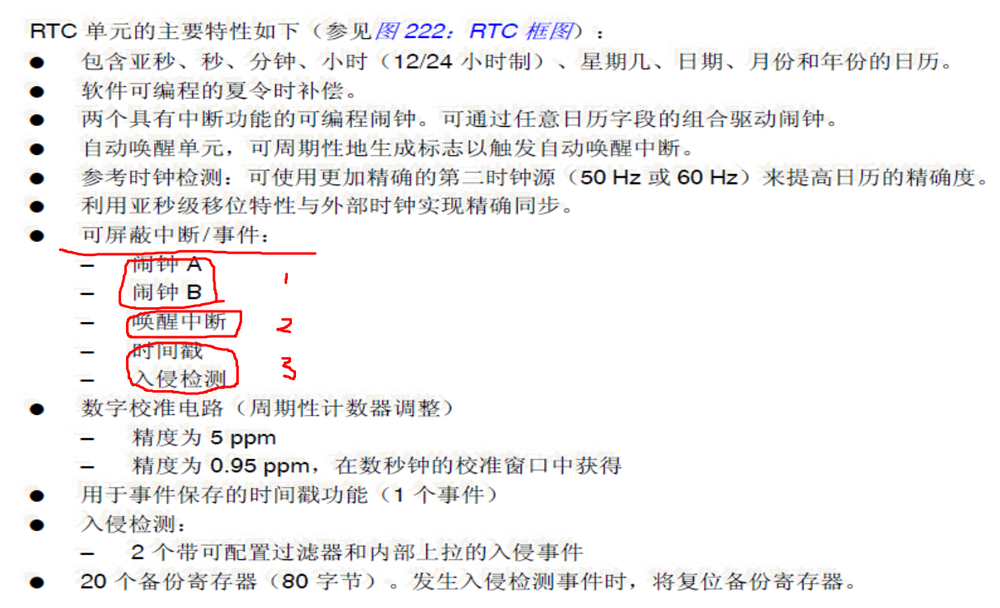
## RTC中断

|中断名 | 中断类型号 | 
|----  | -------  | 
|RTC闹钟中断  | EXTI17  |  
|RTC唤醒中断  | EXTI22  |  
|RTC入侵中断  | EXTI21  |  
|RTC时间戳中断  | EXTI21  |  

1. 将对应的类型中断号配置为中断模式并且使能
2. 配置NVIC中的（RTC_Alarm IRQ、RTC_WKUP IRQ、RTC_STAMP IRQ）通道并且使能
3. 配置RTC以检测对应的RTC事件
   
## RTC时钟源
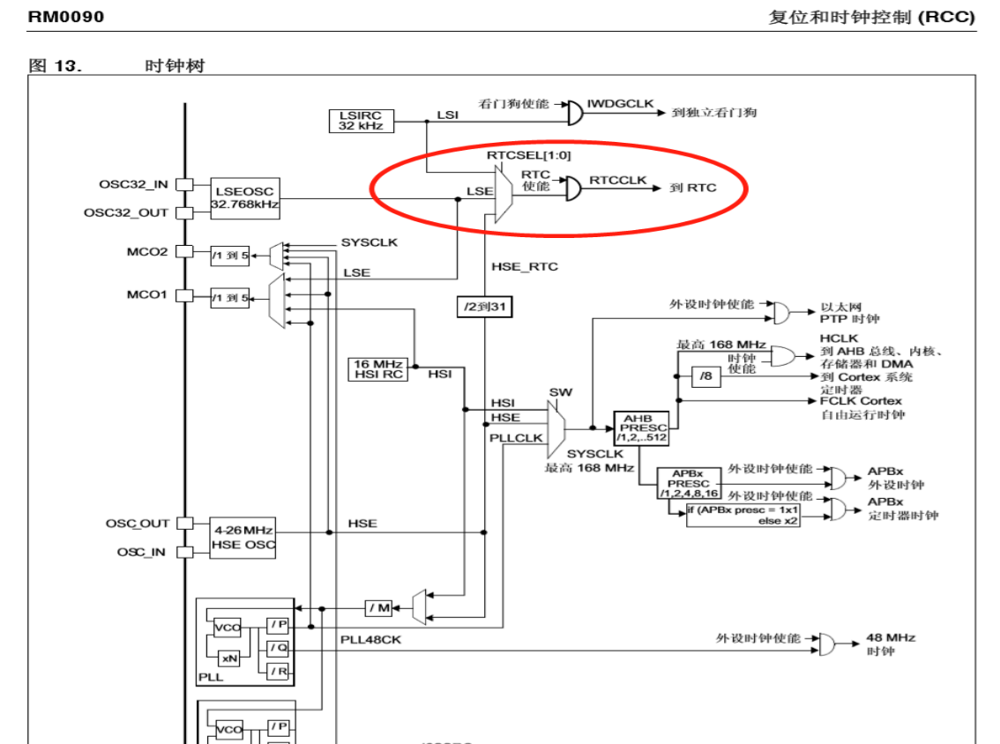

# HD7279芯片
HD7279A是一片具串行接口的芯片。它可完成LED显示、键盘接口的全部功能。
**可同时驱动8位共阴式数码管的智能显示；还可连接多达64键的键盘矩阵**

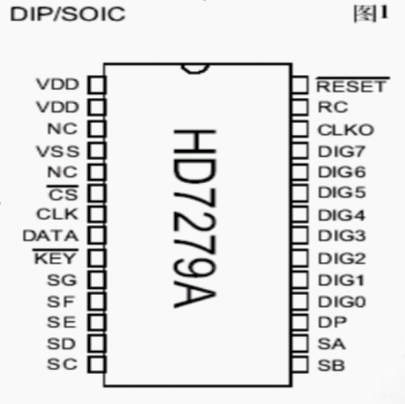
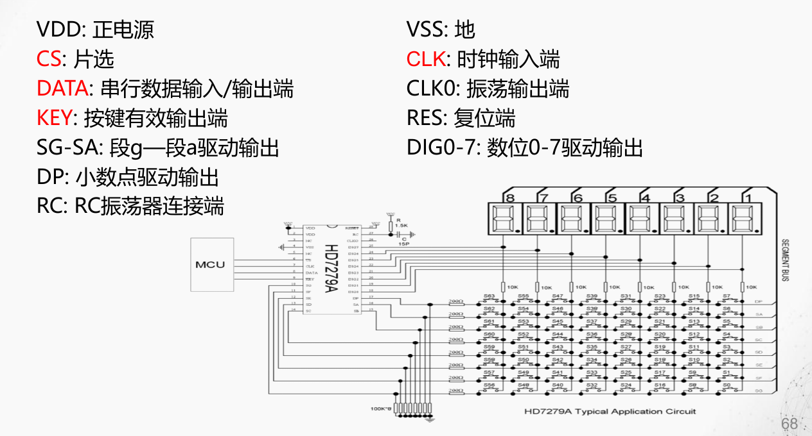

HD7279A的控制指令分为二大类——纯指令和带有数据的指令。
## 纯指令
### 复位清楚指令A4H
|D7|D6|D5|D4|D3|D2|D1|D0|
|-|-|-|-|-|-|-|-|
|1|0|1|0|0|1|0|0|

将所有显示清除、所有设置的字符的消隐、闪烁等也一起被清除。

## 带数据指令
### 下载数据按照方式0译码 （80H - 87H）
高位：
|D7|D6|D5|D4|D3|D2|D1|D0|
|-|-|-|-|-|-|-|-|
|1|0|0|0|0|a2|a1|a0|

低位：
|D7|D6|D5|D4|D3|D2|D1|D0|
|-|-|-|-|-|-|-|-|
|DP|X|X|X|d3|d2|d1|d0|

其中： X 此处不译码；a2、a1、a0为位地址；d3、d2、d1、d0为显示数据
| a2 | a1 | a0 | 显示位 |
|----|----|----|--------|
| 0  | 0  | 0  | 1      |
| 0  | 0  | 1  | 2      |
| 0  | 1  | 0  | 3      |
| 0  | 1  | 1  | 4      |
| 1  | 0  | 0  | 5      |
| 1  | 0  | 1  | 6      |
| 1  | 1  | 0  | 7      |
| 1  | 1  | 1  | 8      |

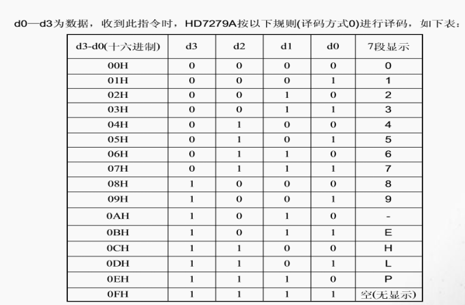
### 下载数据按照方式1译码 （C8H - CFH）
高位：
|D7|D6|D5|D4|D3|D2|D1|D0|
|-|-|-|-|-|-|-|-|
|1|1|0|0|1|a2|a1|a0|

低位：
|D7|D6|D5|D4|D3|D2|D1|D0|
|-|-|-|-|-|-|-|-|
|DP|X|X|X|d3|d2|d1|d0|

其中： X 此处不译码；a2、a1、a0为位地址；d3、d2、d1、d0为显示数据
| a2 | a1 | a0 | 显示位 |
|----|----|----|--------|
| 0  | 0  | 0  | 1      |
| 0  | 0  | 1  | 2      |
| 0  | 1  | 0  | 3      |
| 0  | 1  | 1  | 4      |
| 1  | 0  | 0  | 5      |
| 1  | 0  | 1  | 6      |
| 1  | 1  | 0  | 7      |
| 1  | 1  | 1  | 8      |

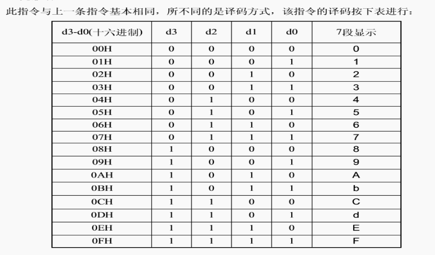

### 下载数据不译码（90H - 97H）
高位：
|D7|D6|D5|D4|D3|D2|D1|D0|
|-|-|-|-|-|-|-|-|
|1|0|0|1|0|a2|a1|a0|

低位：
|D7|D6|D5|D4|D3|D2|D1|D0|
|-|-|-|-|-|-|-|-|
|DP|A|B|C|D|E|F|G|

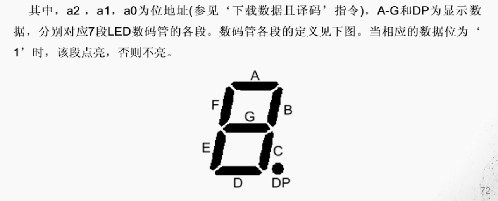

# SPI接口
*一种**高速的，全双工，同步**的通信总线。*
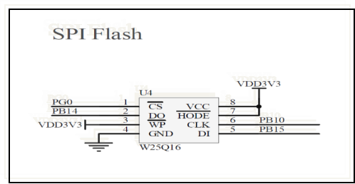
Serial Peripheral interface，即串行外围设备接口。是Motorola首先在其MC68HCXX系列处理器上定义的。

在芯片的管脚上**只占用四根线**，具有节约芯片管脚、可为PCB节省空间等优点。

主要应用在 EEPROM、FLASH、实时时钟、AD转换器、数字信号处理器和数字信号解码器之间。

可以是8位数据传送，也可以是16位，可编程；既可以高位先行，也可以低位先行。

## W25Q16特点
1. SPI接口，容量为 16Mb ，也就是 2 M字节。
2. W25Q16将2M的容量分为32 个块（Block ）
3. 每个块（Block ）大小为64K 字节，有16个Sector
4. W25Q16的擦写周期多达10万次（读不损耗）
5. 具有 20 年的数据保存期限

在STM32F407的开发环境中，“变量”的值可以在“调试”时观察

## 与7279的区别
### 都是串行芯片
但7279：MCU通过软件，来模拟实现并变串、串变并的对HD7279的数据传输，采用半双工通信

W25Q16：MCU通过硬件，来模拟实现并变串、串变并的对W25Q16的数据传输，可以采用全双工通信

## 命令识别码
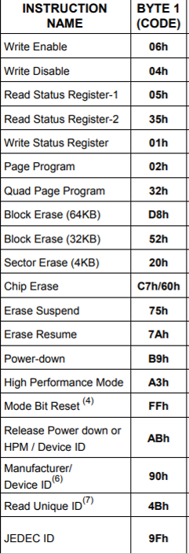

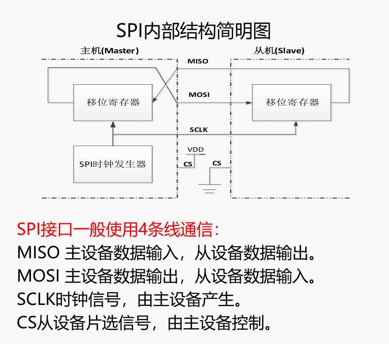

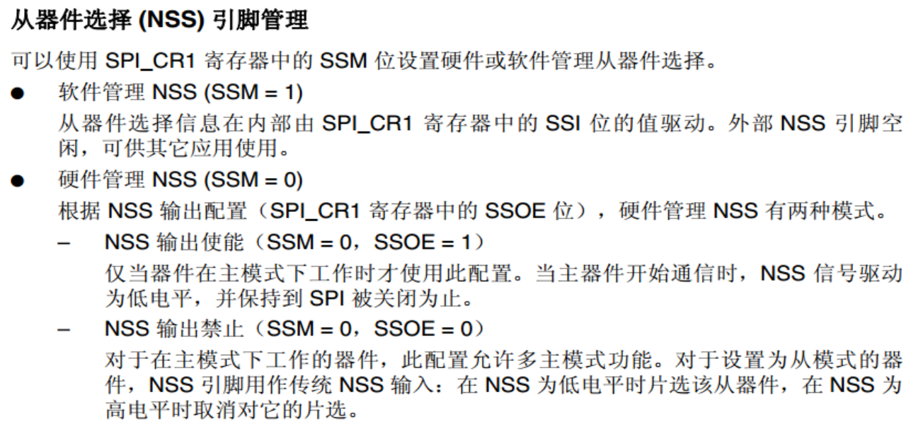

# 点阵
16x16点阵用的是四块 CL-788BS（8*8微型点阵）和四块74HC595的8位串入并出的位移寄存器。

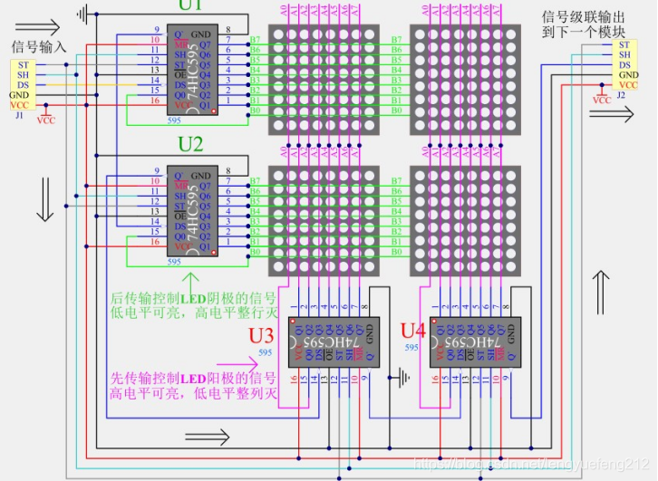
24X24LCD点阵：\
CL-788BS  共9片， \
74HC595  （行加一片，列加一片）共6片\
如图，这是16x16的接线图， 将 CL-788BS 组成3x3矩阵，同时再加两片74HC595  对应相比16x16的多出的1行和1列。