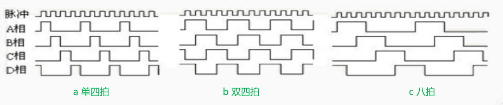
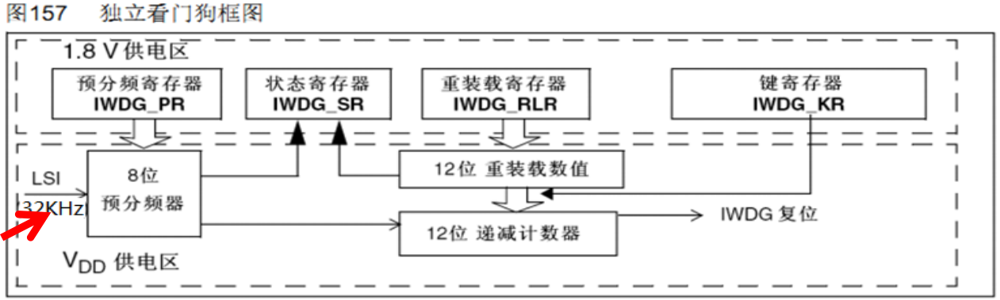
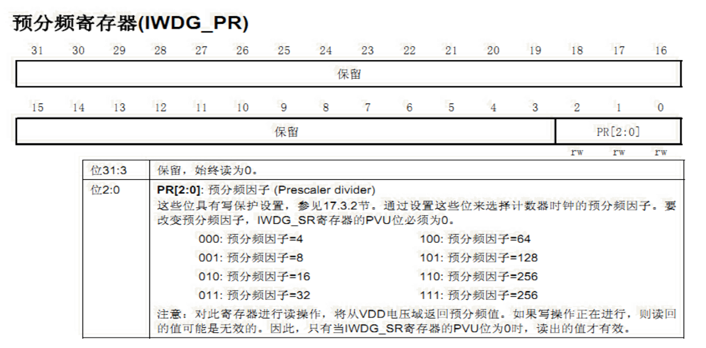
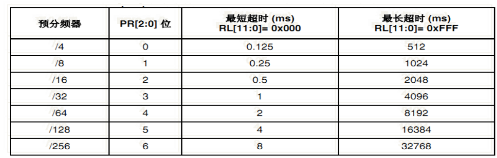
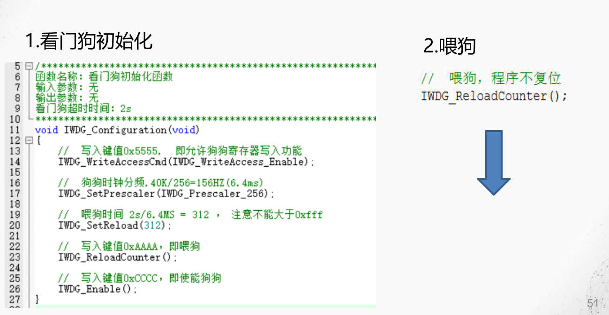
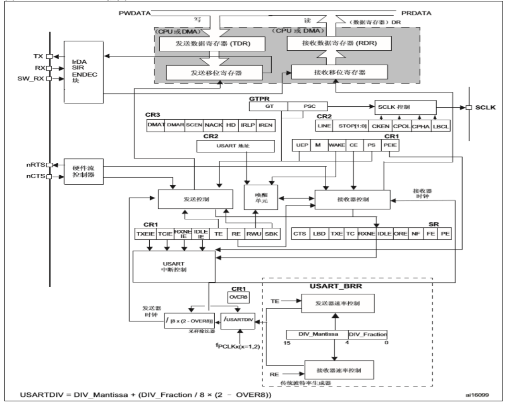
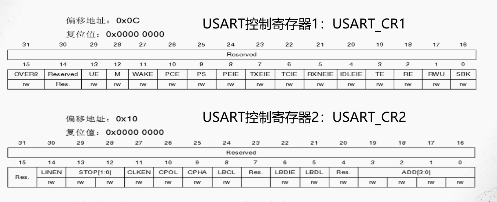
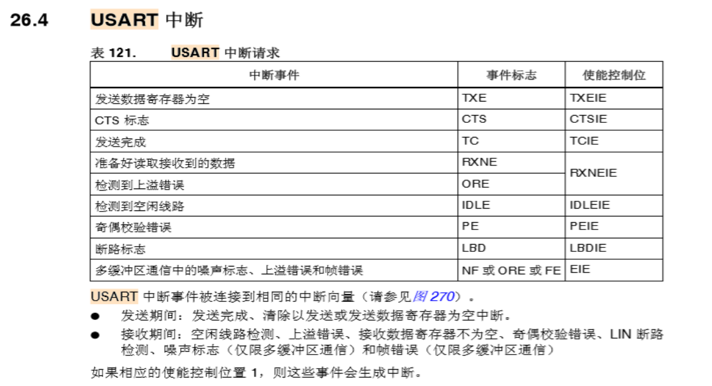
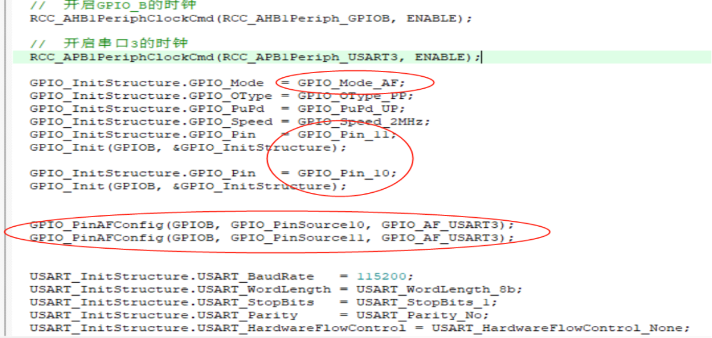

# 步进电机
步进电机是一种能够将**电脉冲信号转换成角位移或线位移**的机电元件， 是机电一体化的关键产品之一。
## 步进电机的驱动方式
四相步进电机按照**线圈通电顺序的不同**，可分为**单四拍、双四拍、八拍**三种驱动方式。

从一个时刻看上去如，有多少个高电平（有的是低电平有效，注意）为1是单，为2是双；一个周期占据多少脉冲周期为多少拍。

## 歩距角
$$
   \theta = \frac{360^{\circ}}{转子齿数J*运行拍数n} 
$$

# 看门狗
*在单片机系统中，由于工作常常会受到外界的干扰，如电磁场等，造成程序的正常运行被打断，程序跑飞、陷入死循环……系统无法继续工作，或整个系统陷入停滞状态、发生不可预料的后果。*

**一种专门用于监测单片机程序运行状态的模块或者芯片，俗称“看门狗”(watchdog)** 。

## 键值寄存器IWDG_KR: 
0~15位有效 。**可以发启用（0xCCCC）、喂狗（0xAAAA） 、解锁（0x5555）等命令**。
## 预分频寄存器IWDG_PR
0~2位有效。    **有写保护功能，要操作，得先取消写保护**。

IWDG的时钟预分频值与超时时间极限值:

超时时间计算公式：
$$
    T_{out} = \frac{(4 \times 2^{prer})\times rlr}{32}
\tag{1}
$$
时钟频率LSI=32K， 一个看门狗时钟周期就是最短超时时间。\
最长超时时间= (IWDG_RLR寄存器最大值0xFFF）x  看门狗时钟周期
## 重装载寄存器IWDG_RLR
0~11位有效。**有写保护功能，要操作，得先取消写保护**。
## 状态寄存器IWDG_SR
0~1位有效。
## IWDG操作步骤
1. 初始化编程
   1. 允许写入PR、RLR ： WDG_WriteAccessCmd();
   2. 设置独立看门狗的预分频系数，确定时钟: WDG_SetPrescaler();
   3. 置看门狗重装载值rlr，确定溢出时间:$T_{out} = \frac{(4 \times 2^{prer})\times rlr}{32}ms$ ： WDG_SetReload();
   4. 使能看门狗 ：WDG_Enable();
2. 操作编程
   1. 应用程序喂狗: WDG_ReloadCounter();

# USART串口原理

## 相关寄存器

## USART中断

### USART/UART中断有哪几个？中断名是什么？
CTS change interrupt. \
LIN((local interconnection network) Break detection interrupt.\
Tansmit Data Register empty interrupt.\
Transmission complete interrupt.\
Receive Data register not empty interrupt.\
Idle line detection interrupt.\
Parity Error interrupt.\
Error interrupt(Frame error, noise error, overrun error).\
硬流控的发送允许状态改变中断\
本地互连网络破坏检测中断\
发送数据寄存器空中断\
接收数据寄存器不空中断\
uart空闲检测中断\
极性错误中断\
错误中断（帧错误，杂讯错误，溢出错误）

## 串口线与gpiox引脚的关系
GPIO引脚复用方式充当串口线！
## AFRL、AFRH 这两个寄存器的作用
是将内部Usartx（等接口设备）使用的固定对应的GPIOx：配置成“复用方式”
